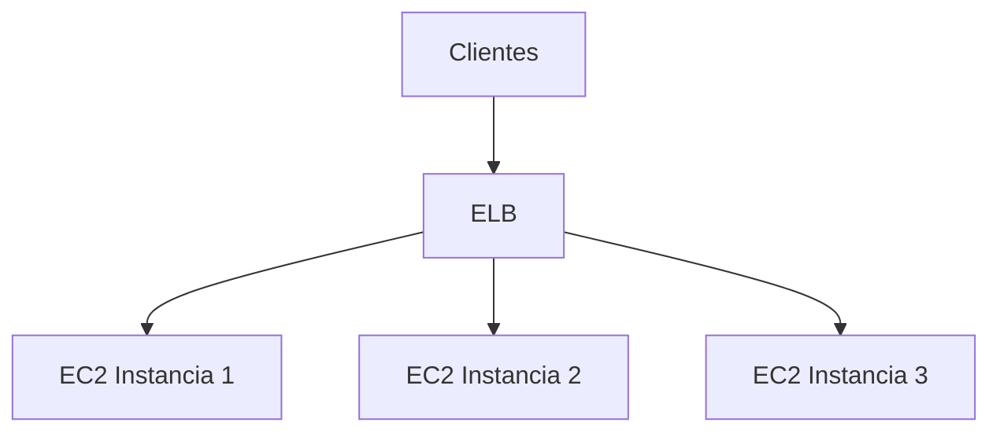
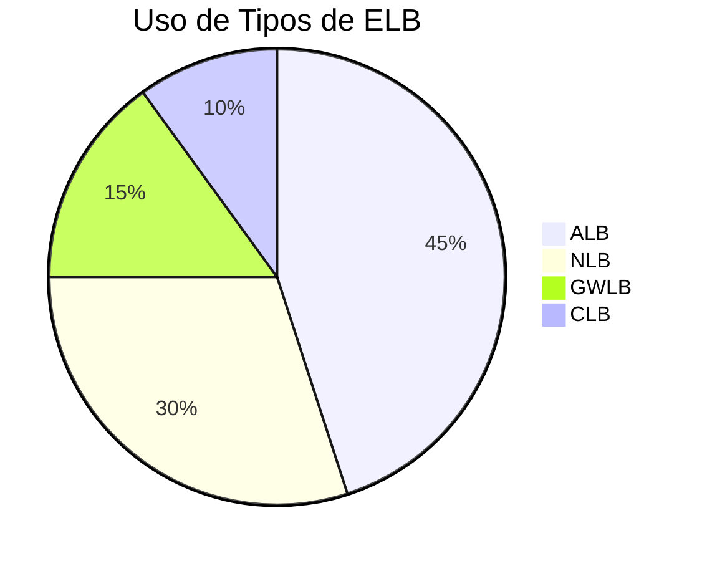
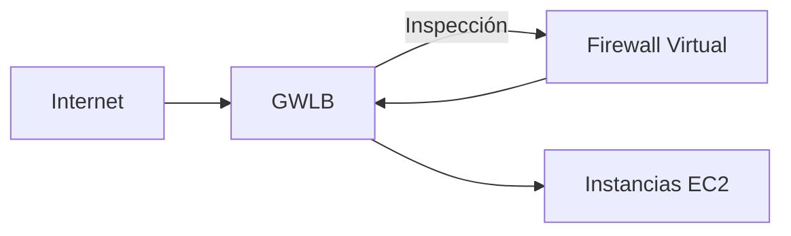
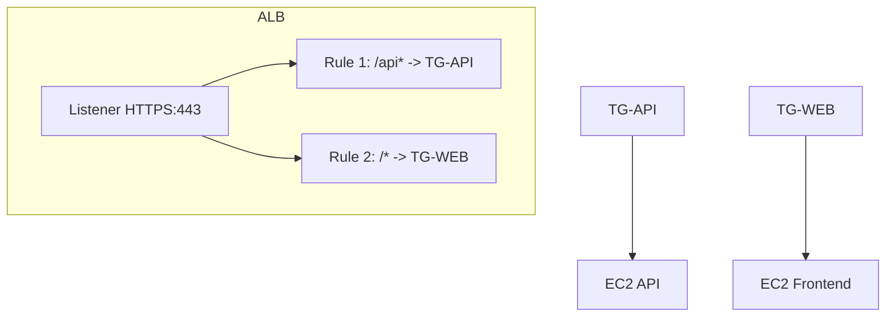

# **Elastic Load Balancing (ELB) en AWS: Guía Completa para Arquitectos**

## **Introducción a Elastic Load Balancing**
AWS Elastic Load Balancing (ELB) es un servicio que distribuye el tráfico de aplicaciones entre múltiples destinos como instancias EC2, contenedores e IPs, mejorando disponibilidad, rendimiento y escalabilidad.



## **¿Cómo Funciona ELB?**
1. **Recepción de Solicitudes**: Los clientes (navegadores, apps móviles) envían solicitudes al ELB.
2. **Chequeos de Salud**: Verifica qué instancias están sanas.
3. **Algoritmo de Distribución**: Usa round-robin, least connections o IP hash.
4. **Enrutamiento**: Dirige tráfico a instancias sanas.
5. **Respuesta**: Las instancias procesan y devuelven respuestas a través del ELB.

### **Beneficios Clave**
- 📈 **Alta disponibilidad**: Elimina puntos únicos de fallo
- ⚡ **Rendimiento optimizado**: Reduce latencia con enrutamiento inteligente
- 💰 **Ahorro de costos**: Escala automáticamente según demanda
- 🔒 **Seguridad**: Encriptación SSL/TLS integrada

## **Tipos de Load Balancers en AWS**

### **Tabla Comparativa**
| **Tipo**               | **Capa OSI** | **Protocolos**       | **Casos de Uso**                     | **Ejemplo**                |
|------------------------|-------------|----------------------|--------------------------------------|----------------------------|
| **Classic (CLB)**      | Capa 4      | TCP, SSL             | Legacy apps                         | Balanceo básico            |
| **Application (ALB)**  | Capa 7      | HTTP/HTTPS, gRPC     | Microservicios, contenedores        | Routing por URL/path       |
| **Network (NLB)**      | Capa 4      | TCP, UDP, TLS        | Gaming, streaming de baja latencia  | Tráfico de alto throughput |
| **Gateway (GWLB)**     | Capa 3      | IP                   | Firewalls virtuales, IDS/IPS        | Seguridad perimetral       |



## **Componentes Clave (ALB/NLB)**
1. **Listeners**: 
   - Define puerto/protocolo (ej: HTTPS 443)
   ```bash
   aws elbv2 create-listener --load-balancer-arn my-alb --protocol HTTPS --port 443
   ```
2. **Target Groups**:
   - Grupos lógicos de destinos (EC2, Lambda, IPs)
3. **Rules (Solo ALB)**:
   - Enrutamiento avanzado por:
     - Path (/api, /images)
     - Host (api.mydomain.com)
     - Headers HTTP

## **Gateway Load Balancer (GWLB) - Caso Especial**
Arquitectura para seguridad:


**Características únicas**:
- ✳️ **Integración con appliances virtuales** (Check Point, Fortinet)
- 🔄 **Bypass de tráfico no inspeccionado**
- 🌐 **Opera a nivel de red (IP)**

## **Mejores Prácticas**
1. **Para aplicaciones web modernas**:
   - Usa **ALB** con:
     - Routing basado en paths
     - Autoscaling integrado
     ```bash
     aws autoscaling attach-load-balancer-target-groups --auto-scaling-group-name my-asg --target-group-arns my-target-group
     ```
2. **Para ultra baja latencia**:
   - **NLB** con preservación de IP fuente
3. **Escenarios híbridos**:
   - **GWLB** para integrar firewalls on-premise/cloud

## **Ejemplo de Configuración ALB**


**Comando CLI**:
```bash
aws elbv2 create-rule \
    --listener-arn arn:aws:elasticloadbalancing:us-east-1:123456789012:listener/app/my-alb/50dc6c495c0c9188 \
    --conditions Field=path-pattern,Values='/api/*' \
    --actions Type=forward,TargetGroupArn=arn:aws:elasticloadbalancing:us-east-1:123456789012:targetgroup/my-api-tg/73e2d6bc24d8a067
```

## **Conclusión**
- **ALB**: Ideal para arquitecturas modernas (microservicios, serverless)
- **NLB**: Perfecto para tráfico masivo de baja latencia
- **GWLB**: Esencial para despliegues de seguridad avanzada
