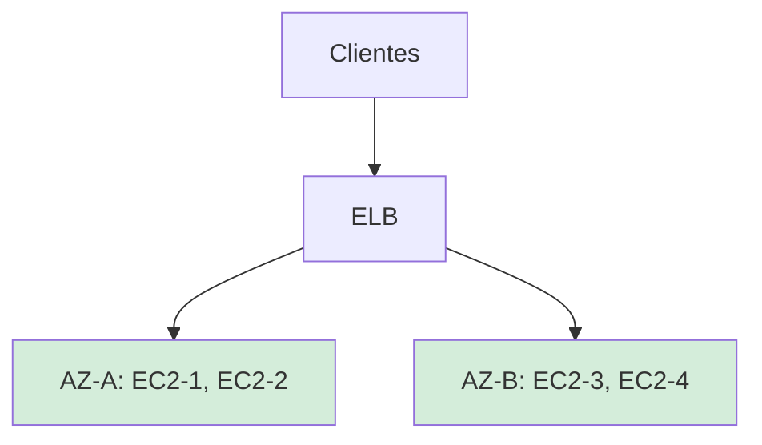
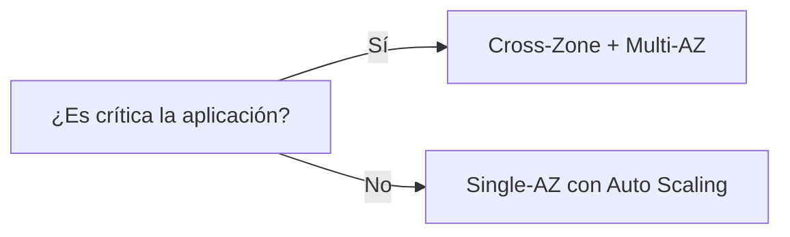

# **Balanceo de Carga Cruzado entre Zonas (Cross-Zone Load Balancing) en AWS**

## **¿Qué es el Cross-Zone Load Balancing?**
Es una funcionalidad de Elastic Load Balancing (ELB) que distribuye tráfico **equitativamente** entre instancias EC2 ubicadas en **diferentes zonas de disponibilidad (AZs)** dentro de una misma región AWS.



## **Cómo Funciona**
1. **Arquitectura Base**:
   - Cada ELB tiene nodos en múltiples AZs
   - Las instancias EC2 se despliegan en 2+ AZs
   - El tráfico se distribuye **uniformemente** entre todas las instancias registradas, sin importar su AZ

2. **Ejemplo de Flujo**:
   ```mermaid
   sequenceDiagram
       Cliente->>+ELB: Solicitud HTTP
       ELB->>+EC2-AZ-A: Procesar (50% tráfico)
       ELB->>+EC2-AZ-B: Procesar (50% tráfico)
       EC2-AZ-A-->>-ELB: Respuesta
       EC2-AZ-B-->>-ELB: Respuesta
       ELB-->>-Cliente: Respuesta consolidada
   ```

## **Beneficios Clave**
| **Ventaja** | **Impacto** | **Ejemplo** |
|-------------|------------|-------------|
| **Alta disponibilidad** | Elimina SPOF (Single Point of Failure) | Si AZ-A falla, el tráfico se redirige a AZ-B |
| **Mejor rendimiento** | Reduce latencia al elegir la instancia más cercana | Usuario en Europa conecta a instancia en eu-central-1a |
| **Optimización de costos** | Evita sobreaprovisionamiento en una sola AZ | Escala solo las instancias necesarias en cada AZ |

## **Limitaciones a Considerar**
1. **Complejidad Arquitectónica**:
   - Requiere diseñar aplicaciones stateless
   - Bases de datos necesitan replicación multi-AZ (ej: RDS Multi-AZ)

2. **Costos Adicionales**:
   - **Costo de transferencia entre AZs**: $0.01/GB (precio varía por región)
   - Ejemplo de costo adicional:
     ```bash
     # Cálculo estimado para 1TB de tráfico inter-AZ
     echo "1000 GB * $0.01 = $10 adicionales/mes" 
     ```

## **Comparativa: Con/Sin Cross-Zone**
| **Escenario** | **Sin Cross-Zone** | **Con Cross-Zone** |
|---------------|--------------------|--------------------|
| Distribución | 70% tráfico a AZ-A, 30% a AZ-B | 50%-50% entre AZs |
| Tolerancia a fallos | Desbalanceo crítico si una AZ falla | Tráfico se redistribuye automáticamente |
| Caso ideal | Aplicaciones sin requisitos de HA | Aplicaciones críticas con SLA >99.9% |

## **Configuración Práctica**
### **Habilitar Cross-Zone en AWS CLI**
```bash
# Para Application Load Balancer (ALB)
aws elbv2 modify-load-balancer-attributes \
    --load-balancer-arn arn:aws:elasticloadbalancing:us-east-1:123456789012:loadbalancer/app/my-alb/50dc6c495c0c9188 \
    --attributes Key=load_balancing.cross_zone.enabled,Value=true

# Para Network Load Balancer (NLB) - Siempre activo
```

### **Mejor Práctica Recomendada**


## **Conclusión**
El Cross-Zone Load Balancing es ideal para:
- ✅ Aplicaciones empresariales críticas
- ✅ Arquitecturas multi-capa (web + app + DB)
- ✅ Escenarios con requerimientos de alta disponibilidad

**Recomendación final**:  
Use ALB/NLB con Cross-Zone habilitado + Auto Scaling Groups multi-AZ para máxima resiliencia. Monitoree costos con AWS Cost Explorer.
