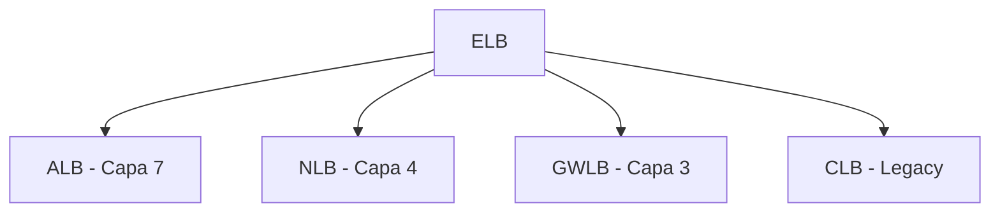
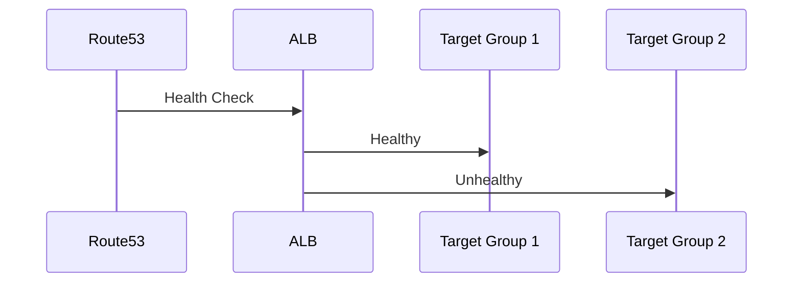
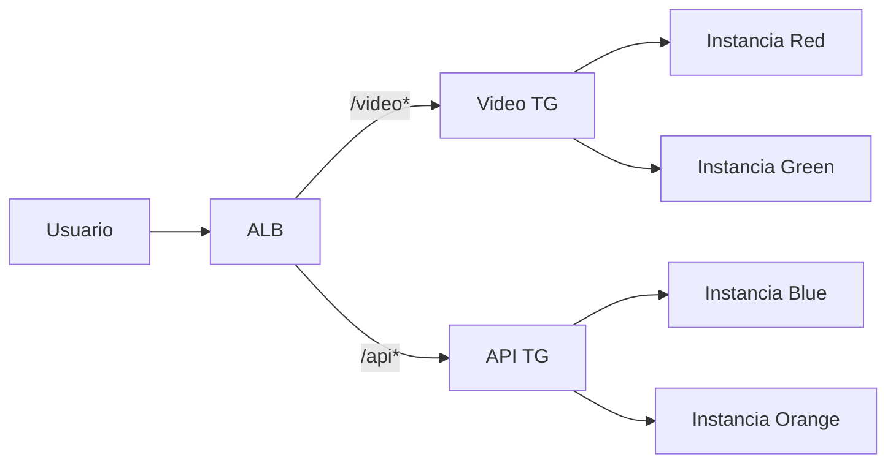

# **Application Load Balancer (ALB) en AWS**

## **Introducción a los Load Balancers en AWS**
AWS Elastic Load Balancing (ELB) distribuye tráfico entre múltiples objetivos como instancias EC2, contenedores ECS y direcciones IP. Los ELB monitorean la salud de los objetivos y escalan automáticamente.

### **Tipos de Load Balancers**


## **Application Load Balancer (ALB) - Profundización**
### **Características Clave**
- **Capa OSI 7** (HTTP/HTTPS)
- **Routing Avanzado**:
  - Basado en paths (/api, /images)
  - Basado en hostnames (api.ejemplo.com)
  - Basado en headers HTTP

### **Componentes Principales**
| **Componente** | **Función** | **Ejemplo CLI** |
|----------------|------------|----------------|
| **Listener** | Escucha en puerto/protocolo | `aws elbv2 create-listener` |
| **Target Group** | Grupo lógico de objetivos | `aws elbv2 create-target-group` |
| **Rules** | Define rutas y acciones | `aws elbv2 create-rule` |

## **Comparativa: ALB vs NLB vs GWLB**
| **Feature** | **ALB** | **NLB** | **GWLB** |
|------------|---------|---------|----------|
| **Capa OSI** | 7 | 4 | 3 |
| **Protocolos** | HTTP/HTTPS | TCP/UDP/TLS | IP |
| **Casos de Uso** | Microservicios, Web Apps | Ultra baja latencia | Firewalls virtuales |
| **Routing Avanzado** | Sí (paths/headers) | No | No |
| **Throughput** | Hasta 100K RPS | Millones de RPS | Depende del appliance |

## **Escenarios de Examen AWS**
### **1. Health Checks y Failover**


### **2. Global Accelerator + ALB**
- **Beneficios**:
  - IPs estáticas globales
  - Routing por red AWS (menor latencia)
  ```bash
  aws globalaccelerator create-accelerator \
    --name my-accelerator \
    --ip-address-type IPV4 \
    --enabled \
    --tags Key=Name,Value=ALB-Accelerator
  ```

### **3. Session Management**
| **Método** | **Ventajas** | **Limitaciones** |
|------------|--------------|------------------|
| **Sticky Sessions** | Simple implementación | Pérdida de sesión si instancia falla |
| **ElastiCache Redis** | Alta disponibilidad | Costo adicional |

## **Demo Práctica: Path-Based Routing**
**Arquitectura a Implementar**:


**Pasos CLI Clave**:
1. Crear Target Groups:
   ```bash
   aws elbv2 create-target-group \
       --name video-tg \
       --protocol HTTP \
       --port 80 \
       --vpc-id vpc-123456
   ```

2. Configurar Reglas:
   ```bash
   aws elbv2 create-rule \
       --listener-arn arn:aws:elasticloadbalancing... \
       --conditions Field=path-pattern,Values='/video*' \
       --actions Type=forward,TargetGroupArn=arn:aws:elasticloadbalancing...
   ```

## **Mejores Prácticas para el Examen**
1. **ALB vs NLB**:
   - ¿Es HTTP/HTTPS? → ALB
   - ¿Necesita ultra baja latencia? → NLB

2. **Global Accelerator**:
   - Usar cuando el escenario mencione "usuarios globales" o "mejorar latencia internacional"

3. **Sesiones**:
   - Para alta disponibilidad: ElastiCache > Sticky Sessions

## **Conclusión**
El ALB es esencial para arquitecturas modernas:
- ✅ Microservicios
- ✅ Aplicaciones web complejas
- ✅ Escenarios multi-AZ

**¿Listo para el laboratorio?** En la siguiente parte implementaremos:
1. ALB con path routing
2. Configuración via CLI
3. Integración con EC2 y security groups
