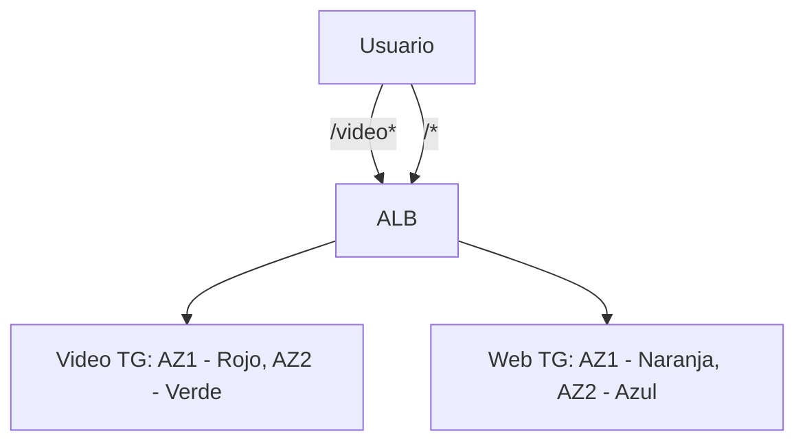

# **Laboratorio Práctico: Implementación de un Application Load Balancer (ALB) con AWS CLI**

## **Introducción**
En este laboratorio, implementaremos un **Application Load Balancer (ALB)** con:
- Path-based routing (/video y /web)
- Dos Target Groups (video y web)
- Cuatro instancias EC2 distribuidas en múltiples AZs



## **Paso 1: Configuración Inicial**
### **1.1 Variables de Entorno Clave**
```bash
# Configurar VPC y AMI
export VPC_ID="vpc-123456"  # Reemplazar con tu VPC
export AMI_ID="ami-0abcdef1234567890"  # Amazon Linux 2
export KEY_NAME="tu-keypair"
```

### **1.2 Crear Security Group**
```bash
# Crear SG y abrir puertos
SG_ID=$(aws ec2 create-security-group --group-name "ALB-SG" --description "SG para ALB" --vpc-id $VPC_ID --output text)
aws ec2 authorize-security-group-ingress --group-id $SG_ID --protocol tcp --port 22 --cidr $(curl ifconfig.me)/32
aws ec2 authorize-security-group-ingress --group-id $SG_ID --protocol tcp --port 80 --cidr 0.0.0.0/0
```

## **Paso 2: Despliegue de Infraestructura**
### **2.1 Crear Subnets en Diferentes AZs**
```bash
# Subnet en us-east-1a
SUBNET_1=$(aws ec2 create-subnet --vpc-id $VPC_ID --cidr-block "172.31.128.0/20" --availability-zone "us-east-1a" --query 'Subnet.SubnetId' --output text)

# Subnet en us-east-1b
SUBNET_2=$(aws ec2 create-subnet --vpc-id $VPC_ID --cidr-block "172.31.192.0/20" --availability-zone "us-east-1b" --query 'Subnet.SubnetId' --output text)
```

### **2.2 Lanzar Instancias EC2**
**User Data para Servidores Web** (`web-server.sh`):
```bash
#!/bin/bash
yum install -y httpd
systemctl start httpd
echo "<html><body style='background-color:orange;'>Web Server 1</body></html>" > /var/www/html/index.html
```

```bash
# Lanzar instancias
WEB1=$(aws ec2 run-instances --image-id $AMI_ID --instance-type t2.micro --key-name $KEY_NAME --security-group-ids $SG_ID --subnet-id $SUBNET_1 --user-data file://web-server.sh --query 'Instances[0].InstanceId' --output text)

WEB2=$(aws ec2 run-instances --image-id $AMI_ID --instance-type t2.micro --key-name $KEY_NAME --security-group-ids $SG_ID --subnet-id $SUBNET_2 --user-data file://web-server.sh --query 'Instances[0].InstanceId' --output text)
```

## **Paso 3: Configurar ALB**
### **3.1 Crear ALB**
```bash
ALB_ARN=$(aws elbv2 create-load-balancer --name "demo-alb" --subnets $SUBNET_1 $SUBNET_2 --security-groups $SG_ID --query 'LoadBalancers[0].LoadBalancerArn' --output text)
```

### **3.2 Crear Target Groups**
```bash
# Target Group para Web
WEB_TG_ARN=$(aws elbv2 create-target-group --name "web-tg" --protocol HTTP --port 80 --vpc-id $VPC_ID --query 'TargetGroups[0].TargetGroupArn' --output text)

# Target Group para Video
VIDEO_TG_ARN=$(aws elbv2 create-target-group --name "video-tg" --protocol HTTP --port 80 --vpc-id $VPC_ID --query 'TargetGroups[0].TargetGroupArn' --output text)
```

### **3.3 Configurar Listeners y Reglas**
```bash
# Listener predeterminado (/* -> Web TG)
LISTENER_ARN=$(aws elbv2 create-listener --load-balancer-arn $ALB_ARN --protocol HTTP --port 80 --default-actions Type=forward,TargetGroupArn=$WEB_TG_ARN --query 'Listeners[0].ListenerArn' --output text)

# Regla para /video* -> Video TG
aws elbv2 create-rule --listener-arn $LISTENER_ARN --priority 10 --conditions Field=path-pattern,Values='/video*' --actions Type=forward,TargetGroupArn=$VIDEO_TG_ARN
```

## **Paso 4: Validación**
### **4.1 Obtener DNS del ALB**
```bash
ALB_DNS=$(aws elbv2 describe-load-balancers --load-balancer-arns $ALB_ARN --query 'LoadBalancers[0].DNSName' --output text)
echo "Accede a: http://$ALB_DNS"
```

### **4.2 Probar Path-Based Routing**
| **URL**               | **Target Group** | **Color Instancia** |
|-----------------------|------------------|---------------------|
| `http://[ALB_DNS]`    | Web TG           | Naranja/Azul        |
| `http://[ALB_DNS]/video` | Video TG        | Rojo/Verde          |

## **Paso 5: Limpieza**
```bash
# Eliminar ALB, Target Groups, Instancias y Subnets
aws elbv2 delete-load-balancer --load-balancer-arn $ALB_ARN
aws elbv2 delete-target-group --target-group-arn $WEB_TG_ARN
aws elbv2 delete-target-group --target-group-arn $VIDEO_TG_ARN
aws ec2 terminate-instances --instance-ids $WEB1 $WEB2
aws ec2 delete-subnet --subnet-id $SUBNET_1
aws ec2 delete-subnet --subnet-id $SUBNET_2
aws ec2 delete-security-group --group-id $SG_ID
```

## **Conclusión**
Este laboratorio demostró:
- ✅ **Path-Based Routing** con ALB
- ✅ **Integración Multi-AZ** para alta disponibilidad
- ✅ **Automatización completa** con AWS CLI

**Para el examen AWS SAP**:
- Diferenciar ALB (HTTP/HTTPS) vs NLB (TCP/UDP)
- Entender prioridad de reglas (menor número = mayor prioridad)
- Saber limpiar recursos para evitar costos innecesarios
