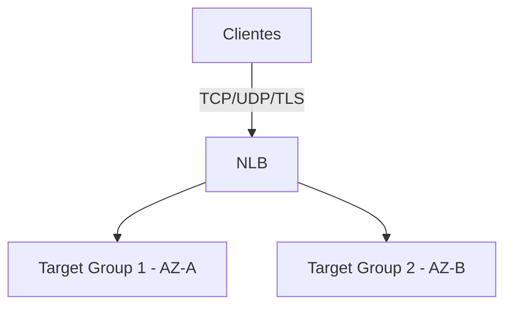
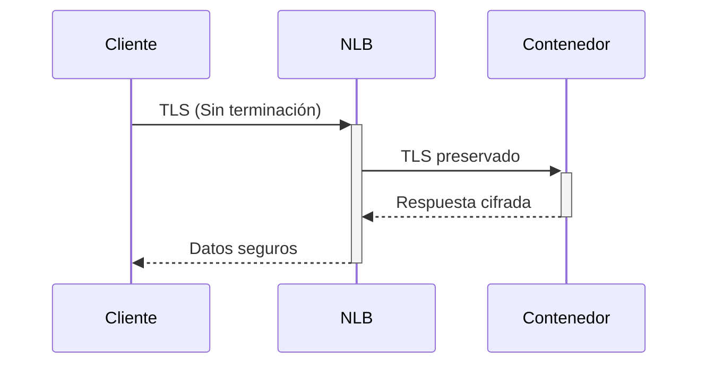
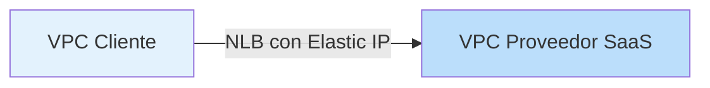
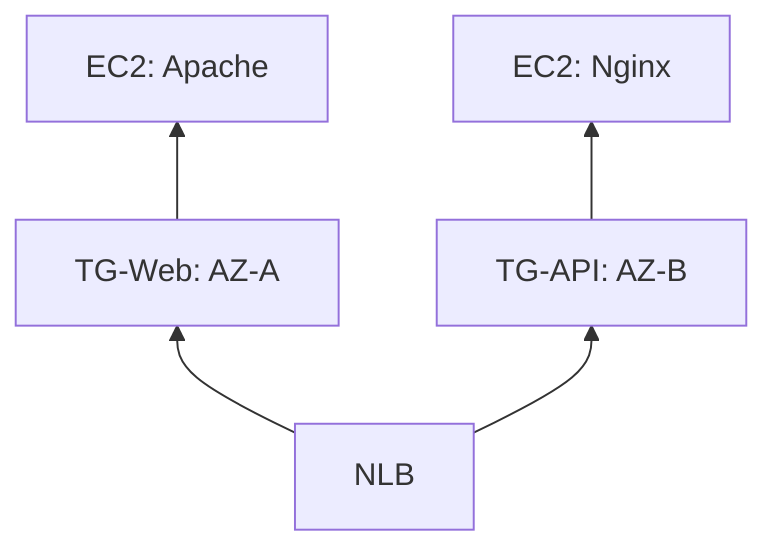

# **Network Load Balancer (NLB) en AWS**

## **¿Qué es un Network Load Balancer?**
El NLB es un balanceador de carga de **Capa 4** (Transporte) del modelo OSI, diseñado para:
- **Alto rendimiento**: Millones de solicitudes/segundo
- **Protocolos soportados**: TCP, TLS y UDP
- **Baja latencia**: Ideal para aplicaciones sensibles a tiempos de respuesta



## **Diferencias Clave: NLB vs ALB**
| **Característica**       | **NLB**                     | **ALB**                     |
|--------------------------|----------------------------|----------------------------|
| **Capa OSI**             | 4 (Transporte)             | 7 (Aplicación)             |
| **Protocolos**           | TCP, UDP, TLS              | HTTP, HTTPS                |
| **Rendimiento**          | Ultra baja latencia        | Alto throughput HTTP       |
| **IP Elásticas**         | ✔️ Soporte nativo          | ❌ No soportado            |
| **WebSockets**           | Ideal para conexiones largas| Compatible pero menos eficiente|

## **Casos de Uso Típicos**
### **1. Arquitectura con TLS End-to-End**

- **Ejemplo**: Sistemas financieros que requieren cifrado hasta el backend

### **2. Balanceo UDP**
- **Flujos consistentes**: Misma IP+puerto → mismo target
- **Aplicaciones**: VoIP, streaming en tiempo real

### **3. Comunicación Cross-Account/VPC**


## **Configuración Avanzada**
### **Cross-Zone Load Balancing**
| **Configuración**       | **Comportamiento**                     |
|-------------------------|---------------------------------------|
| **Desactivado** (default) | Tráfico solo a targets en la misma AZ |
| **Activado**            | Tráfico distribuido en todas las AZs  |

**CLI para activar Cross-Zone**:
```bash
aws elbv2 modify-load-balancer-attributes \
    --load-balancer-arn arn:aws:elasticloadbalancing:us-east-1:123456789012:loadbalancer/app/my-nlb/50dc6c495c0c9188 \
    --attributes Key=load_balancing.cross_zone.enabled,Value=true
```

### **Algoritmo de Enrutamiento**
- **TCP/TLS**: Hash basado en:
  ```python
  hash(protocolo, IP_origen, puerto_origen, IP_destino, puerto_destino)
  ```
- **UDP**: Mismo flujo → mismo target

## **Preguntas Frecuentes en el Examen AWS**
1. **¿Cuándo usar NLB?**
   - Cuando el escenario mencione: "ultra baja latencia", "TCP/UDP", o "IPs estáticas"

2. **TLS en NLB**:
   - Requiere certificados server-side
   - Puede terminar TLS o pasar tráfico cifrado (passthrough)

3. **Comunicación híbrida**:
   - NLB + Elastic IP es ideal para conectar on-premise con AWS

## **Demo Próximo: Laboratorio NLB**
**Implementaremos**:
1. NLB con dos Target Groups
2. Configuración TCP (no HTTP)
3. Pruebas con:
   - `telnet` para validar conectividad
   - `curl` para ver distribución de carga

**Estructura del Lab**:


## **Conclusión**
- **NLB es la opción** para cargas de trabajo que requieren:
  - **Extremo rendimiento** (gaming, trading algorítmico)
  - **Protocolos no-HTTP** (UDP, TCP crudo)
  - **IPs estáticas** para whitelisting en firewalls

**¿Listo para el laboratorio?** En la siguiente sesión construiremos esta arquitectura paso a paso usando AWS CLI.
