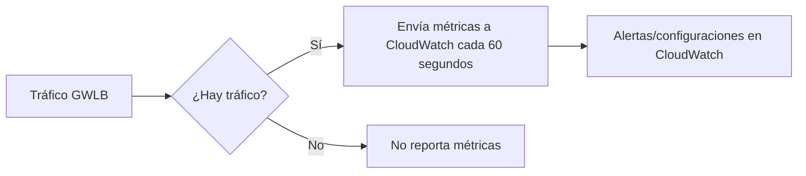

# **Monitoreo y Métricas del Gateway Load Balancer de AWS**

## **Introducción al Monitoreo del GWLB**
El Gateway Load Balancer (GWLB) de AWS integra métricas clave en **Amazon CloudWatch** para proporcionar visibilidad sobre:
- **Flujos de tráfico**
- **Estado de los targets (appliances virtuales)**
- **Consumo de recursos**

Estos datos son esenciales para garantizar alta disponibilidad y escalabilidad en aplicaciones que utilizan appliances virtuales (firewalls, IDS/IPS).

---

## **Métricas Clave del GWLB en CloudWatch**
### **Tabla de Métricas Principales**
| **Métrica**               | **Descripción**                                                                 | **Unidad**  | **Importancia**                          |
|---------------------------|-------------------------------------------------------------------------------|------------|----------------------------------------|
| **ActiveFlowCount**       | Conexiones concurrentes activas entre clientes y targets.                     | Count      | Capacidad actual de manejo de tráfico.  |
| **ConsumedLCUs**          | Unidades de Capacidad del Load Balancer utilizadas (facturación).             | Count      | Costos operativos.                      |
| **HealthyHostCount**      | Número de appliances virtuales en estado "healthy".                           | Count      | Disponibilidad del servicio.            |
| **NewFlowCount**          | Nuevas conexiones establecidas en un período.                                  | Count/sec  | Demanda y patrones de tráfico.          |
| **ProcessedBytes**        | Bytes procesados (excluye tráfico de health checks).                          | Bytes      | Volumen total de datos inspeccionados.  |
| **UnhealthyHostCount**    | Appliances virtuales fallando health checks.                                  | Count      | Detección temprana de problemas.        |

---

## **Cómo Funciona el Monitoreo**

### **Características Importantes:**
1. **Frecuencia de Reporte**:
   - Datos enviados **cada 60 segundos** solo si hay tráfico activo.
2. **Health Checks**:
   - Verifican estado de appliances virtuales (puerto 6081).
3. **Integración con AWS Services**:
   - Usa **CloudWatch Alarms** para notificaciones SNS o auto escalado.

---

## **Precios y Free Tier**
### **Estructura de Costos (Ejemplo: Región Mumbai)**
| **Concepto**               | **Costo**               | **Free Tier**              |
|----------------------------|-------------------------|---------------------------|
| **GWLB por hora**          | $0.01/hora             | 750 horas/mes gratis.     |
| **GLCU (Unidad de Capacidad)** | $0.0085/GLCU-hora  | -                         |

**Ejemplo de Cálculo**:
- 100 nuevas conexiones/segundo × 4 minutos = **0.4 GLCU**.
- Costo estimado: `$0.01 + (0.4 × $0.0085) = $0.0134/hora`.

> 📌 **Nota**: Los precios varían por región. Consulta la [página de precios de AWS](https://aws.amazon.com/elasticloadbalancing/pricing/).

---

## **Laboratorio Práctico: Configurar Alarmas**
### **Pasos para Monitorear Healthy Hosts**
1. **Accede a CloudWatch**:
   - Consola AWS → CloudWatch → Metrics → ELB.
2. **Selecciona métrica**:
   - Namespace: `AWS/ELB` → Metric: `HealthyHostCount`.
3. **Crea una alarma**:
   - Umbral: `< 1` (si hay 0 targets saludables).
   - Acción: Notificar via SNS o activar Auto Scaling.

---

## **Mejores Prácticas**
### **Lista de Recomendaciones**
1. **Alertas Proactivas**:
   - Configura alarmas para `UnhealthyHostCount > 0`.
2. **Optimización de Costos**:
   - Usa Auto Scaling para ajustar appliances según `ActiveFlowCount`.
3. **Logs Adicionales**:
   - Habilita **VPC Flow Logs** para auditoría de tráfico.
4. **Dashboard Personalizado**:
   - Crea paneles en CloudWatch con:
     - Consumo de LCUs.
     - Tendencias de NewFlowCount.

---

## **Conclusión**
El monitoreo del GWLB permite:
✔ **Garantizar alta disponibilidad** de appliances virtuales.  
✔ **Optimizar costos** con métricas de capacidad (GLCUs).  
✔ **Detectar anomalías** mediante alarmas en CloudWatch.  

🔗 **Documentación**: [Métricas de GWLB](https://docs.aws.amazon.com/elasticloadbalancing/latest/gateway/load-balancer-cloudwatch-metrics.html)  
