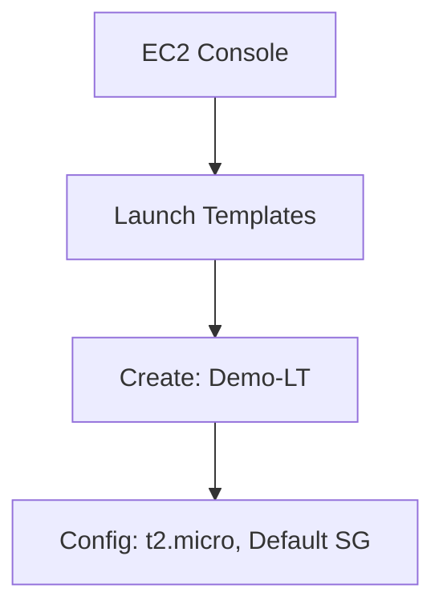
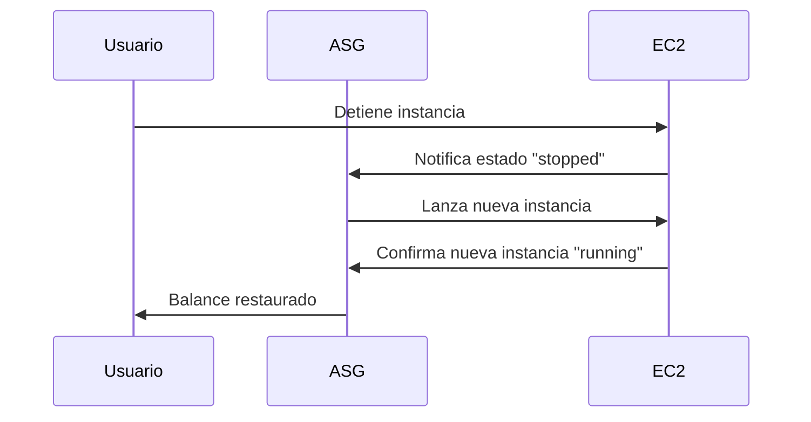

# **Demostración Práctica de EC2 Auto Scaling en AWS**

## **Configuración de Auto Scaling Paso a Paso**

### **1. Creación del Launch Template**
Primer paso esencial para definir la configuración base de las instancias EC2 que se crearán automáticamente.

**Pasos realizados:**
1. Accedemos a **EC2 → Launch Templates → Create Launch Template**.
2. Nombre: `Demo-LT`.
3. Configuración:
   - **AMI**: No seleccionar Amazon Linux (usamos la segunda opción disponible).
   - **Instance Type**: `t2.micro` (económico para pruebas).
   - **Key Pair**: Ninguno (para simplificar la demo).
   - **Security Group**: Grupo por defecto.
4. Confirmamos la creación.

---

### **2. Configuración del Auto Scaling Group (ASG)**
Grupo lógico que gestiona el escalado de instancias según políticas definidas.

**Parámetros clave:**
| **Configuración**       | **Valor**      | **Explicación**                                  |
|-------------------------|---------------|------------------------------------------------|
| **Nombre**              | `Demo-ASG`    | Identificador del grupo.                        |
| **Launch Template**     | `Demo-LT`     | Plantilla creada en el paso anterior.           |
| **VPC**                 | Default VPC   | Red virtual donde se desplegarán las instancias.|
| **Availability Zones**  | Todas         | Para alta disponibilidad multi-AZ.              |

**Capacidad:**
- **Desired**: 2 (instancias siempre activas).
- **Mínimo**: 1 (límite inferior al reducir carga).
- **Máximo**: 3 (límite superior al aumentar carga).

---

### **3. Comprobación del Funcionamiento**
**Escenario de prueba:** Simulamos un fallo en una instancia para verificar la autoreparación.

1. **Estado inicial**:
   - 2 instancias en estado `running` (como configurado en "Desired Capacity").
2. **Acción**:
   - Detenemos manualmente una instancia.
3. **Resultado**:
   - El ASG detecta el cambio y lanza una nueva instancia automáticamente para mantener el count deseado (2).

---

## **Beneficios Clave Demostrados**
### **Lista de Ventajas**
1. **Auto-Recuperación**:
   - Reemplazo automático de instancias fallidas.
2. **Balance de Carga**:
   - Mantiene el número deseado de instancias sin intervención manual.
3. **Optimización de Costos**:
   - Evita sobreaprovisionamiento (máx. 3 instancias en este caso).

---

## **Conclusión**
Esta demo muestra cómo EC2 Auto Scaling:
✔ **Simplifica la gestión de infraestructura** en AWS.  
✔ **Garantiza alta disponibilidad** mediante autoreparación.  
✔ **Se integra fácilmente** con otros servicios como ELB y CloudWatch.  

📌 **Tip**: Para producción, configura políticas de escalado basadas en métricas (CPU, tráfico) para un ajuste más dinámico.  

🔗 **Documentación**: [AWS Auto Scaling](https://docs.aws.amazon.com/autoscaling/ec2/userguide/what-is-amazon-ec2-auto-scaling.html)  

¡Experimenta ajustando los parámetros de capacidad y observa el comportamiento en tiempo real! 🚀
