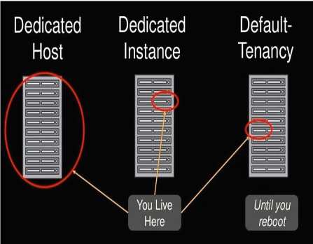

# **Opciones de Compra, Planes de Ahorro y Modelos de Tenencia en Amazon EC2**

## **Introducción**  
Estudiamos las **opciones de compra**, **planes de ahorro** y **modelos de tenencia** de Amazon EC2. Estos conceptos son clave para optimizar costos y adaptar la infraestructura a las necesidades de tu carga de trabajo.

---

## **1. Opciones de Compra para Instancias EC2**  
AWS ofrece múltiples formas de adquirir instancias, cada una con ventajas según el uso y presupuesto:  

### **Tabla Comparativa de Opciones de Compra**  

| **Opción**            | **Compromiso**       | **Ahorro vs. On-Demand** | **Ideal para**                                                                 | **Riesgos**                          |
|-----------------------|----------------------|--------------------------|------------------------------------------------------------------------------|--------------------------------------|
| **On-Demand**         | Ninguno              | 0%                       | Cargas impredecibles, proyectos cortos o pruebas.                            | Costos altos en uso prolongado.      |
| **Reserved Instances**| 1 o 3 años           | Hasta 75%                | Cargas estables y predecibles (ej. servidores de producción).                | Penalización por subutilización.     |
| **Spot Instances**    | Ninguno (ofertas)    | Hasta 90%                | Cargas tolerantes a interrupciones (ej. batch processing, CI/CD).            | Terminación abrupta si el precio sube. |

---

### **Detalle de Reserved Instances (RIs)**  
Los **RIs** permiten reservar capacidad a largo plazo con descuentos. Tienen tres modalidades de pago:  

#### **Opciones de Pago para RIs**  
1. **Pago Total por Adelantado (All Upfront)**  
   - **Descuento máximo** (hasta 75%).  
   - Ideal para empresas con liquidez.  

2. **Pago Parcial (Partial Upfront)**  
   - **Descuento moderado** (~50%).  
   - Balance entre costo inicial y ahorro.  

3. **Sin Pago Inicial (No Upfront)**  
   - **Descuento mínimo** (~25%).  
   - Flexible, pero con pagos mensuales más altos.  

> 📌 **Nota:** El rendimiento y disponibilidad son idénticos en todas las opciones.  

---

## **2. Planes de Ahorro (Savings Plans)**  
Alternativa flexible a los RIs, aplicable a **EC2, Lambda y Fargate**.  

### **Tipos de Savings Plans**  
| **Tipo**                | **Cobertura**                          | **Ahorro** | **Flexibilidad**                              |
|-------------------------|----------------------------------------|------------|-----------------------------------------------|
| **Compute Savings Plan**| Cualquier instancia EC2, Lambda, Fargate | Hasta 72%  | Cambio entre familias/regiones sin penalización. |
| **EC2 Instance Savings Plan** | Instancias específicas (familia/tamaño) | Hasta 72%  | Modificar tamaño dentro de la misma familia.    |
| **SageMaker Savings Plan** | Uso exclusivo en SageMaker           | Hasta 64%  | Aplicación automática a instancias SageMaker.   |

#### **Beneficios Clave**  
✅ **Simplicidad:** Sin gestionar reservas individuales.  
✅ **Flexibilidad:** Adaptable a cambios en la demanda.  
✅ **Recomendaciones:** Usa **AWS Cost Explorer** para identificar el plan óptimo.  

---

## **3. Modelos de Tenencia**  
Define cómo se comparte el hardware subyacente en AWS:  

### **Comparativa de Modelos de Tenencia**  

| **Modelo**          | **Aislamiento**       | **Costo**       | **Caso de Uso**                                                                 |
|----------------------|-----------------------|-----------------|---------------------------------------------------------------------------------|
| **Shared (Predeterminado)** | Multitenant (varios clientes en mismo servidor) | Más económico   | Cargas genéricas sin requisitos de compliance.                                  |
| **Dedicated Instance** | Hardware físico dedicado (pero sin control sobre ubicación) | Alto            | Cumplimiento normativo (ej. HIPAA, GDPR).                                       |
| **Dedicated Host**   | Servidor físico completo asignado al usuario.  | Muy alto        | Licencias por-socket/núcleo (ej. SQL Server), control granular sobre el hardware. |



---

### **Diagrama: ¿Cuándo Usar Cada Modelo?**  
```plaintext
¿Necesitas cumplimiento estricto o licencias específicas?  
│  
├── Sí → **Dedicated Host** (control total)  
├── Parcialmente → **Dedicated Instance** (aislamiento sin gestión)  
└── No → **Shared Tenancy** (ahorro de costos)  
```

---

## **Conclusión**  
- **Opciones de compra:** Elige entre On-Demand, Reserved o Spot según previsibilidad y tolerancia a interrupciones.  
- **Planes de ahorro:** Ideal para reducir costos en cargas estables con flexibilidad.  
- **Tenencia:** Shared para la mayoría de casos; Dedicated para compliance/licencias.  

> 🔍 **Recomendación final:** Usa **AWS Cost Explorer** para analizar tu uso histórico y seleccionar la combinación óptima.  
