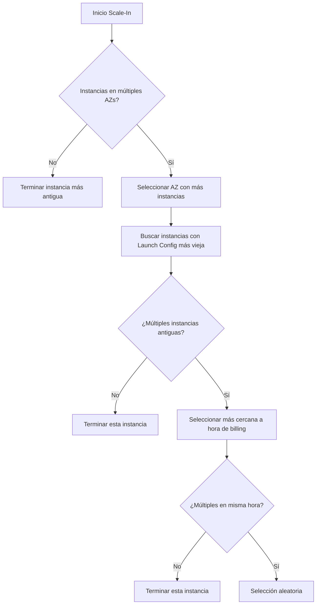

# **Lógica de Terminación de Instancias en EC2 Auto Scaling**

## **Cómo Decide AWS Qué Instancia Terminar al Reducir Capacidad**

El servicio EC2 Auto Scaling sigue un algoritmo específico (no aleatorio) para seleccionar qué instancias terminar durante un **Scale-In**. Esta lógica prioriza:

1. **Distribución Multi-AZ**
2. **Antigüedad de Configuración**
3. **Optimización de Costos**
4. **Selección Aleatoria (último recurso)**

---

## **Proceso Detallado de Selección**
### **Diagrama de Decisión**

---

## **Reglas de Priorización (Orden de Evaluación)**
1. **Balance entre Availability Zones (AZs)**:
   - Si hay instancias en múltiples AZs, Auto Scaling elige la AZ con **más instancias** para mantener distribución equilibrada.

2. **Antigüedad de Launch Configuration/Template**:
   - Dentro de la AZ seleccionada, prioriza instancias con la **configuración más antigua** (mayor tiempo de ejecución).

3. **Optimización de Costos**:
   - Si hay empate en antigüedad, elige la instancia más cercana a su **hora de facturación completa** (ej: terminar a las 2:55 en lugar de 2:10 para ahorrar costos en instancias Windows/Linux bajo facturación por hora).

4. **Último Recurso**:
   - Si persiste el empate, selección **aleatoria**.

---

## **Ejemplo Práctico**
### **Escenario**:
- **AZ us-east-1a**: 3 instancias (Launch Template v1, creadas hace 2h).
- **AZ us-east-1b**: 2 instancias (1 con LT v1 hace 2h, 1 con LT v2 hace 1h).
- **Scale-In requerido**: Terminar 1 instancia.

### **Proceso**:
1. **Paso 1**: Selecciona **us-east-1a** (tiene más instancias).
2. **Paso 2**: Elige las 3 instancias con LT v1 (todas igual de antiguas).
3. **Paso 3**: De ellas, selecciona la que esté más cerca de completar su hora de facturación (ej: iniciada a las 10:05 si es ahora 10:58).
4. **Resultado**: Termina la instancia en us-east-1a que cumple estos criterios.

---

## **Tabla Resumen de Criterios**
| **Prioridad** | **Criterio**                     | **Objetivo**                                  |
|---------------|----------------------------------|---------------------------------------------|
| 1             | AZ con más instancias           | Mantener balance de carga multi-AZ.        |
| 2             | Launch Config más antigua       | Rotación saludable de instancias.          |
| 3             | Cercanía a hora de billing      | Minimizar costos en facturación horaria.   |
| 4             | Selección aleatoria             | Resolver empates irreducibles.             |

---

## **Conclusión**
Entender esta lógica ayuda a:
✔ **Predecir el comportamiento** de Auto Scaling en reducciones de capacidad.  
✔ **Optimizar costos** con estrategias de horario de despliegues.  
✔ **Diseñar arquitecturas resilientes** (ej: usar múltiples AZs para evitar terminaciones concentradas).  

📌 **Mejor Práctica**: Usa **Launch Templates** actualizados y monitorea el estado de las AZs para mantener alta disponibilidad.  

🔗 **Documentación**: [AWS Auto Scaling Termination Policies](https://docs.aws.amazon.com/autoscaling/ec2/userguide/ec2-auto-scaling-termination-policies.html)  

¡Configura tus ASGs con esta lógica en mente para un escalado inteligente! ⚙️
