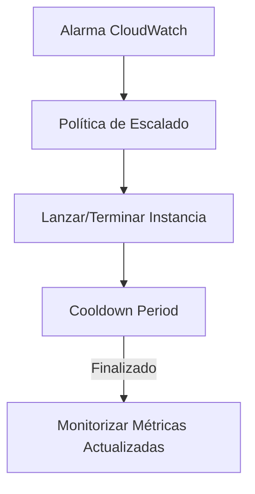
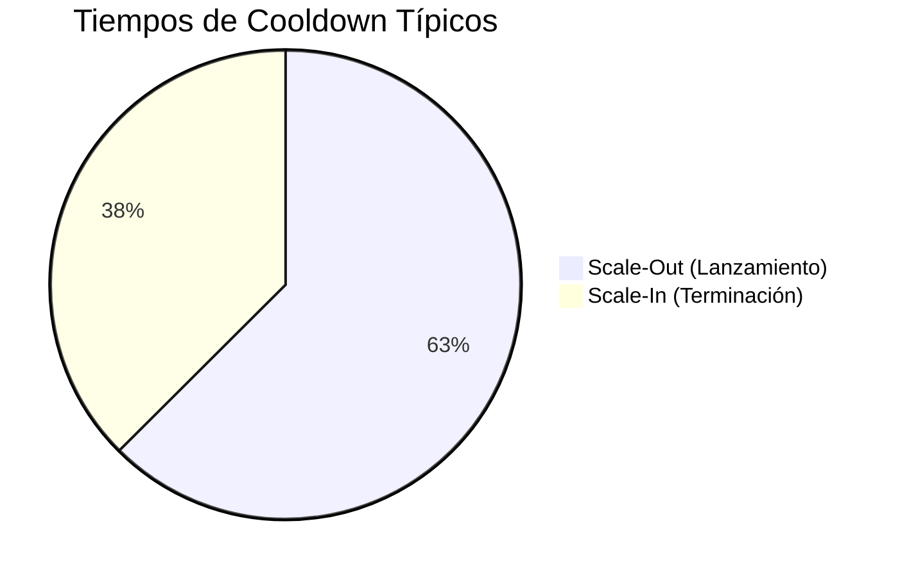

# **Períodos de Enfriamiento (Cooldown) en Auto Scaling Groups de AWS**

## **Concepto y Funcionamiento de los Cooldown Periods**

Los períodos de enfriamiento son mecanismos que **evitan cambios bruscos de escalado** en un Auto Scaling Group (ASG), permitiendo que:
- Las nuevas instancias se estabilicen
- Las métricas de CloudWatch se actualicen
- Se evite el sobre-escalado por métricas obsoletas

### **Diagrama de Flujo del Cooldown**


---

## **Tipos de Políticas de Escalado y sus Cooldowns**

### **Comparativa entre Políticas**
| **Tipo de Política**       | **Mecanismo**                                                                 | **Cooldown Típico** | **Caso de Uso Ideal**                     |
|----------------------------|-----------------------------------------------------------------------------|--------------------|------------------------------------------|
| **Simple Scaling**         | Escala basada en alarmas simples con cooldown fijo.                        | 300s (default)     | Cargas predecibles y estables.           |
| **Target Tracking**        | Ajusta capacidad para mantener métrica en valor objetivo.                  | Dinámico           | Mantener CPU en 70% ± 5%.                |
| **Step Scaling**           | Escala en pasos según gravedad de brecha en alarmas.                       | Configurable       | Picos de tráfico variables (ej: Black Friday). |

---

## **Detalles Clave sobre Cooldowns**

### **1. Cooldown Default (300 segundos)**
- **Aplicación**:
  - Obligatorio para políticas Simple Scaling.
  - Opcional para escalado manual.
- **Propósito**:
  - Esperar que nuevas instancias estén operativas.
  - Evitar escalados basados en métricas no actualizadas.

### **2. Cooldown Específico para Scale-In**
- **Configuración**:
  - Tiempo menor al default (ej: 180s).
- **Razón**:
  - Terminar instancias es más rápido que lanzarlas.
  - Reduce costos al minimizar tiempo de espera innecesario.



---

## **Ejemplo Práctico: Configuración con AWS CLI**
```bash
# Crear ASG con cooldown personalizado
aws autoscaling create-auto-scaling-group \
    --auto-scaling-group-name my-asg \
    --launch-template LaunchTemplateName=my-template \
    --min-size 1 \
    --max-size 10 \
    --default-cooldown 180
```

---

## **Mejores Prácticas**
### **Lista de Recomendaciones**
1. **Para Scale-Out**:
   - Usar cooldown ≥ tiempo de inicialización de tu aplicación.
2. **Para Scale-In**:
   - Configurar cooldown más cortos (50-70% del default).
3. **Monitorización**:
   - Ajustar cooldowns según datos históricos de CloudWatch.
4. **Políticas Avanzadas**:
   - Preferir Target Tracking para cargas dinámicas.

---

## **Conclusión**
Los cooldowns son esenciales para:
✔ **Evitar oscilaciones** en el escalado.  
✔ **Optimizar costos** al reducir escalados innecesarios.  
✔ **Garantizar estabilidad** en aplicaciones críticas.  

📌 **Tip**: Combina **Target Tracking** con **Step Scaling** para manejar tanto variaciones suaves como picos abruptos.  

🔗 **Documentación**: [AWS Auto Scaling Cooldowns](https://docs.aws.amazon.com/autoscaling/ec2/userguide/Cooldown.html)  

¡Ajusta estos parámetros según tus patrones de carga para un escalado inteligente! ⚙️📈
