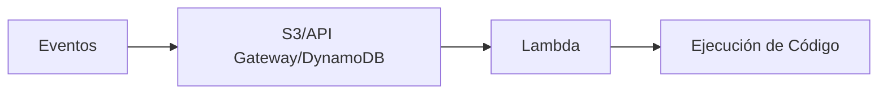
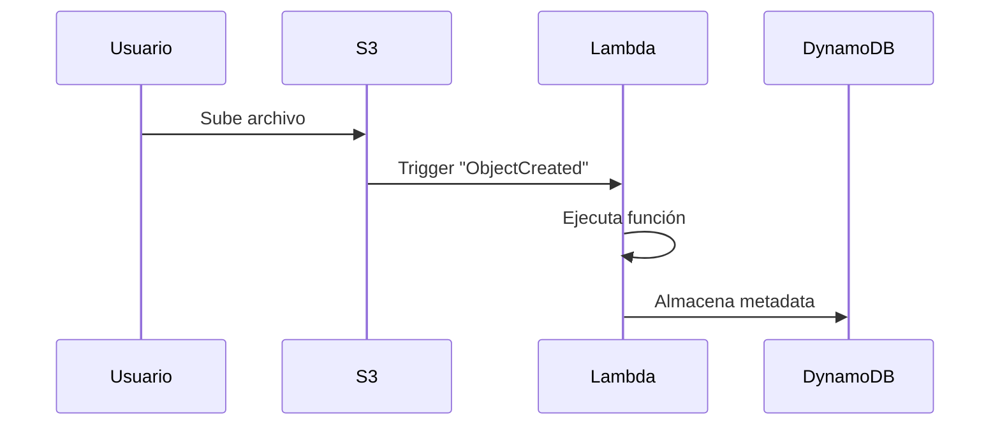

# **Computación Serverless con AWS Lambda**

## **Introducción a Serverless y AWS Lambda**
AWS Lambda es el servicio **serverless** insignia de AWS que permite ejecutar código sin gestionar servidores. Opera bajo un modelo de:
- **Ejecución por eventos**: Responde a triggers como cambios en S3, llamadas API o mensajes en colas.
- **Escalado automático**: Ajusta capacidad en milisegundos según demanda.
- **Pago por uso**: Solo se cobra durante el tiempo de ejecución real.

---

## **Comparativa: Lambda vs EC2**
### **Tabla de Diferencias Clave**
| **Característica**       | **AWS Lambda**                          | **Amazon EC2**                          |
|--------------------------|----------------------------------------|----------------------------------------|
| **Gestión de Infra**     | Totalmente administrado por AWS         | Requiere configuración manual           |
| **Escalado**             | Automático e instantáneo                | Necesita Auto Scaling Groups            |
| **Modelo de Costos**     | Pago por ejecución (GB-segundo)         | Pago por hora incluso en inactividad    |
| **Tiempo Máx Ejecución** | 15 minutos                              | Ilimitado                               |
| **Casos de Uso**         | Microservicios, procesamiento event-driven | Aplicaciones monolíticas persistentes |

---

## **Beneficios de AWS Lambda**
### **Lista de Ventajas**
1. **Sin gestión de servidores**:
   - AWS maneja automáticamente parches, seguridad y disponibilidad.
2. **Escalado nativo**:
   - Soporta hasta **10,000 ejecuciones concurrentes** (límite ajustable).
3. **Integración con servicios AWS**:
   - Conexión directa con 200+ servicios como S3, DynamoDB y API Gateway.
4. **Eficiencia de costos**:
   - Free Tier incluye **1M de invocaciones/mes** y **400,000 GB-segundos**.

---

## **Cómo Funciona Lambda Internamente**
### **Flujo de Ejecución**
1. **Trigger**: Un evento (ej: upload a S3) activa Lambda.
2. **Entorno de Ejecución**:
   - AWS asigna recursos según memoria configurada (128MB - 10GB).
3. **Ejecución**:
   - Código corre en un contenedor efímero.
4. **Resultado**:
   - Retorno a servicio origen o almacenamiento.

---

## **Casos de Uso Comunes**
### **Ejemplos Prácticos**
1. **Procesamiento de Imágenes**:
   - Redimensionar imágenes al subirse a S3.
2. **APIs Serverless**:
   - Backend para apps móviles con API Gateway.
3. **ETL en Tiempo Real**:
   - Transformar datos de Kinesis/DynamoDB Streams.
4. **Automatizaciones**:
   - Limpieza de recursos en horarios con CloudWatch Events.

---

## **Precios y Límites Clave**
### **Estructura de Costos (Ejemplo: región us-east-1)**
| **Concepto**            | **Free Tier**             | **Post Free Tier**       |
|-------------------------|--------------------------|-------------------------|
| Invocaciones            | 1M/mes                   | $0.20 por millón        |
| GB-segundos             | 400,000/mes              | $0.0000166667 por GB-segundo |
| Memoria Configurable    | 128MB - 10GB             | Mayor memoria = mayor costo |

### **Límites Importantes**
- **Tiempo máximo**: 15 minutos/ejecución.
- **Memoria**: Múltiplos de 64MB hasta 10GB.
- **Tamaño deployment**: 50MB (250MB descomprimido).
- **Variables de entorno**: 4KB máximo.

---

## **Configuración Recomendada**
### **Checklist para Implementación**
1. **Definir triggers**:
   - ¿S3, API Gateway, DynamoDB Streams?
2. **Memoria óptima**:
   - Benchmark para balancear costo/performance.
3. **Timeout adecuado**:
   - 1.5x del tiempo promedio de ejecución.
4. **Concurrencia**:
   - Solicitar aumento si se superan 1,000 ejecuciones paralelas.

---

## **Conclusión**
AWS Lambda es ideal para:

✔ **Aplicaciones modernas** basadas en eventos.  
✔ **Reducción de costos** en cargas variables.  
✔ **Prototipado rápido** sin overhead de infraestructura.  

📌 **Tip**: Usa **Capas Lambda** para reutilizar librerías y reduce tamaño de deployments.  

🔗 **Documentación Oficial**: [AWS Lambda](https://docs.aws.amazon.com/lambda/latest/dg/welcome.html)  

¡Experimenta con el Free Tier y descubre el potencial de serverless! 🚀
