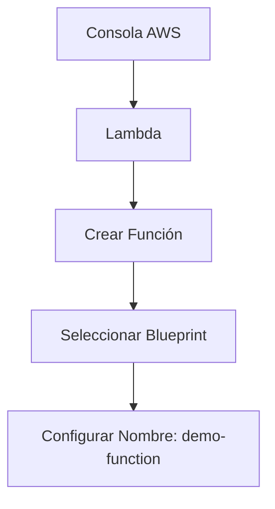

# **Creación y Configuración de Funciones Lambda en AWS: Demostración Práctica**

## **Guía Paso a Paso para Implementar una Función Lambda**

### **1. Creación de la Función Lambda**
1. **Acceso al servicio**:
   - Consola AWS → Buscar "Lambda" → "Crear función".
2. **Opciones de creación**:
   - **Desde cero**: Para código personalizado.
   - **Blueprint**: Plantillas preconfiguradas (usaremos "hello-world-python3.7").
   - **Imagen de contenedor**: Para funciones empaquetadas en Docker.



### **2. Configuración Básica**
| **Parámetro**       | **Valor**               | **Descripción**                                  |
|---------------------|-------------------------|------------------------------------------------|
| **Runtime**         | Python 3.7              | Entorno de ejecución.                          |
| **Memoria**         | 128MB - 10GB (ajustable)| Asignación dinámica de recursos.               |
| **Timeout**         | Hasta 15 minutos        | Límite máximo de ejecución.                    |
| **Permisos**        | Rol IAM automático      | Acceso a CloudWatch Logs y otros servicios AWS.|

---

## **Pruebas y Monitoreo**
### **Flujo de Pruebas**
1. **Crear evento de prueba**:
   - Nombre: `demo-event` (puede ser JSON personalizado).
2. **Ejecutar función**:
   - Ver salida "Hello World" en consola.
3. **Analizar métricas**:
   - Duración, memoria usada, logs en CloudWatch.

```python
# Código de ejemplo (Python 3.7)
def lambda_handler(event, context):
    # Simular error (opcional)
    # raise Exception("Error deliberado para pruebas")
    return {
        'statusCode': 200,
        'body': 'Hello World!'
    }
```

### **Depuración de Errores**
- **CloudWatch Logs**:
  - Registra cada ejecución (éxitos/errores).
  - Identifica líneas de código problemáticas.
- **Métricas clave**:
  - Invocaciones, duración, errores, throttling.

---

## **Configuraciones Avanzadas**
### **Opciones Clave**
1. **Capas (Layers)**:
   - Añadir librerías externas sin incluirlas en el deployment.
2. **Variables de entorno**:
   - Almacenar configuraciones sensibles (ej: API keys).
3. **Triggers**:
   - Configurar disparadores desde S3, API Gateway, DynamoDB, etc.
4. **Concurrencia**:
   - Límite ajustable (hasta 10,000 ejecuciones paralelas).

---

## **Diagrama de Integración**
```
┌─────────────────────────────────────────────────────────────────┐
│                          Event Sources                          │
│  (S3, API Gateway, DynamoDB Streams, CloudWatch Events)         │
└───────────────────────────────┬─────────────────────────────────┘
                                │
┌───────────────────────────────▼─────────────────────────────────┐
│                          AWS Lambda                            │
│  (Ejecuta código → Registra logs → Escala automáticamente)      │
└───────────────────────────────┬─────────────────────────────────┘
                                │
┌───────────────────────────────▼─────────────────────────────────┐
│                       Destinos/Servicios                        │
│  (S3, DynamoDB, SNS, etc.)                                     │
└─────────────────────────────────────────────────────────────────┘
```

---

## **Mejores Prácticas**
### **Checklist para Producción**
- [ ] **Optimizar memoria**: Benchmark para balancear costo/performance.
- [ ] **Manejar errores**: Implementar reintentos lógicos.
- [ ] **Seguridad**: Usar roles IAM con mínimo privilegio.
- [ ] **Monitoreo**: Alertas en CloudWatch para errores/throttling.
- [ ] **Deployment**: Usar CI/CD (CodePipeline, GitHub Actions).

---

## **Conclusión**
Esta demo muestra cómo:
✔ **Implementar rápidamente** funciones serverless.  
✔ **Depurar problemas** usando CloudWatch Logs.  
✔ **Integrarse** con otros servicios AWS.  

📌 **Tip**: Para cargas mayores a 15 minutos, considera **AWS Fargate** o **Step Functions**.  

🔗 **Documentación**: [AWS Lambda](https://docs.aws.amazon.com/lambda/latest/dg/welcome.html)  

¡Experimenta con diferentes triggers y optimiza tus funciones para casos de uso reales! 🚀
