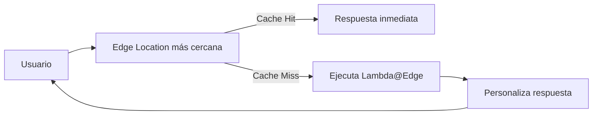
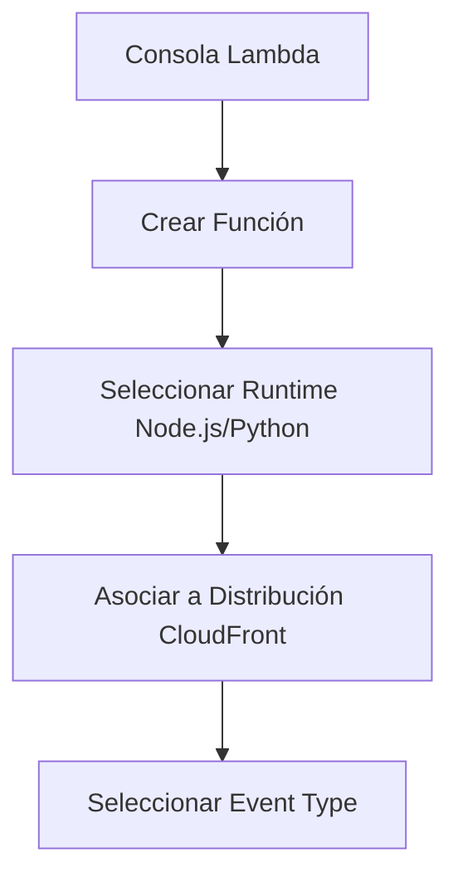

# **Lambda@Edge: Procesamiento en el Borde con AWS CloudFront**

## **Introducción a Lambda@Edge**
Lambda@Edge es una extensión de AWS Lambda que permite ejecutar funciones en **Edge Locations de CloudFront** para personalizar contenido cerca de los usuarios finales. Combina:
- **La potencia de cómputo de Lambda**
- **La red global de entrega de CloudFront** (300+ ubicaciones)



---

## **Cómo Funciona Lambda@Edge**
### **Puntos de Ejecución en el Ciclo de Solicitud**
CloudFront permite ejecutar funciones Lambda en 4 momentos clave:

| **Evento**              | **Descripción**                                                                 | **Caso de Uso Típico**                     |
|-------------------------|-------------------------------------------------------------------------------|-------------------------------------------|
| **Viewer Request**      | Antes de que CloudFront evalúe la caché.                                      | Validación de cookies/headers.            |
| **Origin Request**      | Cuando CloudFront hace una solicitud al origen (cache miss).                  | Modificación de URLs de origen.           |
| **Origin Response**     | Después de recibir respuesta del origen, antes de almacenar en caché.         | Adición de encabezados personalizados.    |
| **Viewer Response**     | Antes de entregar la respuesta al usuario final.                              | Personalización de contenido por dispositivo. |

---

## **Beneficios Clave**
### **Lista de Ventajas**
1. **Reducción de latencia**:
   - Procesamiento en Edge Locations cerca del usuario.
2. **Personalización en tiempo real**:
   - Modificación dinámica de respuestas basada en:
     - Dispositivo (User-Agent)
     - Ubicación geográfica
     - Cookies
3. **Arquitectura serverless**:
   - Sin gestión de infraestructura (AWS maneja el escalado).
4. **Integración con servicios AWS**:
   - Combinable con S3, DynamoDB, Cognito, etc.

---

## **Casos de Uso Comunes**
### **Ejemplos Prácticos**
1. **A/B Testing**:
   - Redirección basada en cookies para pruebas de UX.
2. **Optimización de Imágenes**:
   - Servir imágenes adaptadas al dispositivo (ej: móvil vs escritorio).
3. **Autenticación en el Edge**:
   - Validación de tokens JWT antes de llegar al origen.
4. **Geolocalización**:
   - Mostrar contenido específico por país/región.
5. **Manipulación de Headers**:
   - Agregar encabezados de seguridad (CSP, CORS).

---

## **Configuración Básica**
### **Pasos para Implementar**
1. **Crear función Lambda**:
   - Usar Node.js o Python (únicos lenguajes soportados).
2. **Asociar a CloudFront**:
   - En la distribución, seleccionar evento (viewer/origin request/response).
3. **Desplegar**:
   - AWS replica automáticamente la función a Edge Locations.



---

## **Limitaciones y Consideraciones**
### **Tabla de Restricciones**
| **Aspecto**            | **Límite**                                                                 |
|------------------------|---------------------------------------------------------------------------|
| **Tiempo de ejecución**| Máximo 5 segundos (viewer events) / 30 segundos (origin events).          |
| **Memoria**            | Hasta 128MB (viewer) / 10GB (origin).                                     |
| **Tamaño de código**   | 1MB (viewer) / 50MB (origin).                                             |
| **Regiones**           | Solo disponible en us-east-1 (N. Virginia) para creación de funciones.    |

---

## **Ejemplo: Personalización por Dispositivo**
### **Flujo de Código (Node.js)**
```javascript
exports.handler = (event, context, callback) => {
    const request = event.Records[0].cf.request;
    const headers = request.headers;
    
    // Detectar dispositivo móvil
    const isMobile = headers['user-agent'][0].value.includes('Mobile');
    
    if (isMobile) {
        request.uri = '/mobile' + request.uri;
    }
    
    callback(null, request);
};
```

---

## **Conclusión**
Lambda@Edge es ideal para:
✔ **Aplicaciones globales** que requieren baja latencia.  
✔ **Personalización dinámica** basada en contexto del usuario.  
✔ **Descarga de procesamiento** del origen (reduce costos backend).  

📌 **Mejor Práctica**: Usar para lógica liviana (<5s). Para procesos complejos, considerar **CloudFront Functions** (más rápidas pero menos potentes).  

🔗 **Documentación**: [AWS Lambda@Edge](https://docs.aws.amazon.com/lambda/latest/dg/lambda-edge.html)  

¡Implementa hoy mismo y lleva tu CDN al siguiente nivel! 🌍⚡
