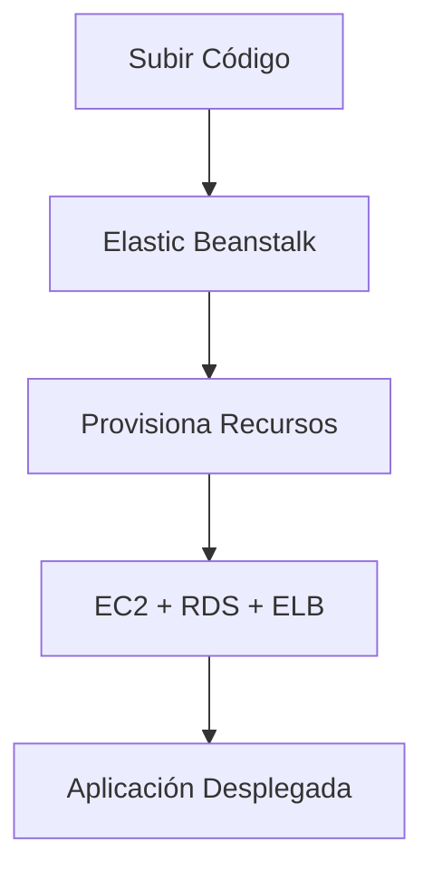
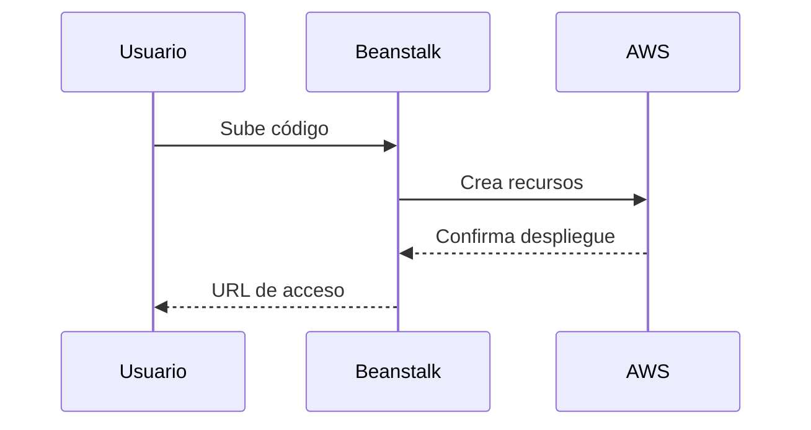

# **AWS Elastic Beanstalk: Despliegue Simplificado de Aplicaciones Web**

## **Introducción a Elastic Beanstalk**
AWS Elastic Beanstalk es un **servicio PaaS (Plataforma como Servicio)** que automatiza el despliegue, escalado y monitoreo de aplicaciones web en la nube de AWS. Permite:

- **Desplegar código** sin gestionar infraestructura
- **Escalar automáticamente** según demanda
- **Soportar múltiples lenguajes**: Java, .NET, Node.js, Python, Ruby, PHP, Go
- **Integrar servicios AWS**: EC2, RDS, ELB, Auto Scaling



---

## **Componentes Clave**
### **Arquitectura Básica**
| **Componente**          | **Función**                                                                 |
|-------------------------|-----------------------------------------------------------------------------|
| **Entorno Web**         | Maneja tráfico HTTP/HTTPS (sitios web, APIs).                              |
| **Entorno Worker**      | Ejecuta procesos en segundo plano (ej: colas SQS).                         |
| **ALB (Application LB)**| Distribuye tráfico entre instancias.                                       |
| **Auto Scaling Group**  | Ajusta capacidad según métricas (CPU, tráfico).                            |
| **RDS**                 | Base de datos gestionada (opcional).                                       |

---

## **Flujo de Trabajo**
### **Pasos para Desplegar**
1. **Crear aplicación**:
   - Nombre y selección de plataforma (ej: "Python 3.8").
2. **Subir código**:
   - Archivo ZIP o imagen Docker.
3. **Configurar entorno**:
   - Tipo de instancias (ej: t3.micro).
   - Variables de entorno.
   - Políticas de escalado.
4. **Despliegue automático**:
   - Beanstalk crea: VPC, EC2, Security Groups, etc.



---

## **Características Principales**
### **Tabla Comparativa de Entornos**
| **Tipo Entorno** | **Caso de Uso**               | **Recursos Típicos**                     |
|------------------|-------------------------------|------------------------------------------|
| **Web Server**   | Aplicaciones web/APIs         | EC2 + ALB + Auto Scaling                 |
| **Worker**       | Procesamiento asíncrono       | EC2 + SQS + Daemon                       |

### **Ventajas Clave**
- **Despliegues Azul/Verde**: Migración sin downtime.
- **Health Monitoring**: Chequeo continuo de instancias.
- **Customización**: Usar archivos `.ebextensions` para configuraciones avanzadas.
- **Integración CI/CD**: Compatible con CodePipeline, GitHub Actions.

---

## **Casos de Uso Comunes**
### **Lista de Aplicaciones**
1. **Startups**: Prototipado rápido sin equipo DevOps.
2. **APIs REST**: Escalado automático para backends.
3. **Sitios CMS**: WordPress, Drupal con alta disponibilidad.
4. **Microservicios**: Contenedores Docker gestionados.
5. **Entornos Dev/Test**: Rápida creación/eliminación.

---

## **Limitaciones**
### **Consideraciones Importantes**
| **Limitación**               | **Alternativa**                          |
|------------------------------|------------------------------------------|
| Control limitado de infra     | Usar EC2 directamente + OpsWorks        |
| Latencia en escalado         | Configurar políticas de Auto Scaling proactivas |
| Costos ocultos               | Monitorear con Cost Explorer            |

---

## **Ejemplo Práctico**
### **Despliegue de API Node.js**
1. **Empaquetar código**:
   ```bash
   zip -r app.zip package.json server.js node_modules/
   ```
2. **CLI Elastic Beanstalk**:
   ```bash
   eb init -p node.js my-api
   eb create prod-env --elb-type application
   ```
3. **Resultado**:
   - URL tipo: `prod-env.elasticbeanstalk.com`

---

## **Conclusión**
Elastic Beanstalk es ideal para:

✔ **Equipos pequeños** que necesitan productividad.  
✔ **Aplicaciones estándar** con requerimientos predecibles.  
✔ **Evitar gestión manual** de infraestructura.  

📌 **Tip**: Para mayor control, usar **archivos .ebextensions** para personalizar recursos.  

🔗 **Documentación**: [AWS Elastic Beanstalk](https://docs.aws.amazon.com/elasticbeanstalk/latest/dg/Welcome.html)  

¡Simplifica tus despliegues en AWS sin sacrificar escalabilidad! 🚀
