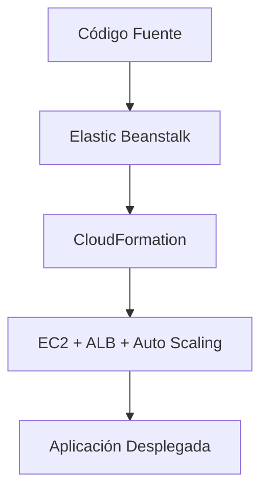
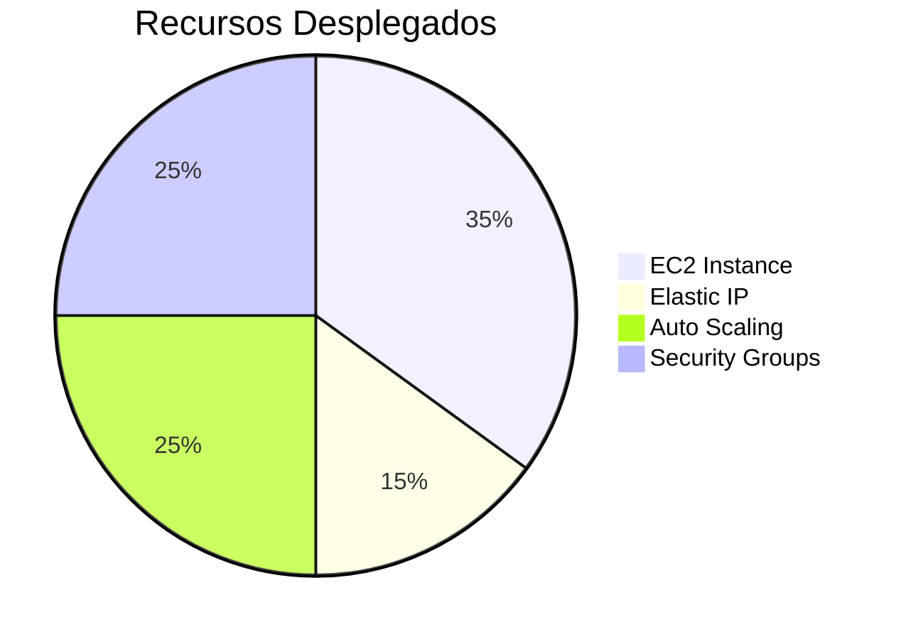

# **Demostración Práctica de AWS Elastic Beanstalk: Despliegue Simplificado de Aplicaciones Web**

## **Introducción a Elastic Beanstalk**
AWS Elastic Beanstalk es un servicio **PaaS (Plataforma como Servicio)** que automatiza el despliegue de aplicaciones web sin gestionar infraestructura. En esta demo, crearemos un entorno web para una aplicación Node.js.

### **Diagrama de Arquitectura**


---

## **Paso 1: Configuración Inicial**
### **Creación del Entorno Web**
1. **Acceso al servicio**:
   - Consola AWS → Buscar "Elastic Beanstalk".
2. **Tipo de entorno**:
   - **Web Server Environment**: Para aplicaciones web/APIs.
   - **Worker Environment**: Para procesos en segundo plano (ej: colas SQS).

| **Parámetro**         | **Configuración**          | **Descripción**                                  |
|-----------------------|---------------------------|------------------------------------------------|
| Nombre aplicación     | `demo-app`                | Identificador único.                           |
| Plataforma           | Node.js                   | Runtime preconfigurado por AWS.                |
| Código fuente        | Aplicación de ejemplo     | ZIP con código Node.js proporcionado por AWS.  |
| Preset              | Single Instance (Free Tier)| Opción económica para pruebas.                 |

---

## **Paso 2: Roles IAM y Seguridad**
### **Configuración de Permisos**
1. **Rol de servicio**:
   - Beanstalk crea automáticamente un rol para gestionar recursos.
2. **Rol EC2**:
   - Manualmente en IAM:
     - Servicio: EC2
     - Políticas adjuntas:
       - `AWSElasticBeanstalkWebTier`
       - `AWSElasticBeanstalkWorkerTier`

```bash
# Ejemplo CLI para crear rol
aws iam create-role \
  --role-name demo-ec2-ebs-role \
  --assume-role-policy-document '{
    "Version": "2012-10-17",
    "Statement": [{
      "Effect": "Allow",
      "Principal": {"Service": "ec2.amazonaws.com"},
      "Action": "sts:AssumeRole"
    }]
  }'
```

---

## **Paso 3: Despliegue Automatizado**
### **Recursos Creados (via CloudFormation)**
Elastic Beanstalk utiliza CloudFormation para crear:
- **EC2 Instance**: Host para la aplicación.
- **Elastic IP**: Dirección IP pública.
- **Auto Scaling Group**: Escalado básico (1 instancia en demo).
- **Security Groups**: Reglas de tráfico HTTP/80.



---

## **Paso 4: Verificación y Monitoreo**
### **Panel de Control Post-Despliegue**
1. **URL de acceso**:
   - Ej: `demo-app-env.elasticbeanstalk.com`
2. **Métricas clave**:
   - Health Status (Verde/Amber/Rojo)
   - CPU Utilization
   - Network In/Out
3. **Logs**:
   - Acceso a registros de aplicación via consola.

---

## **Gestión del Ciclo de Vida**
### **Actualizaciones y Eliminación**
| **Acción**               | **Proceso**                                                                 |
|--------------------------|-----------------------------------------------------------------------------|
| **Nueva Versión**        | Subir ZIP actualizado → "Upload and Deploy".                                |
| **Rollback**             | Seleccionar versión anterior en "Application Versions".                     |
| **Eliminar Entorno**     | Actions → Delete Application → Elimina todos los recursos automáticamente.  |

---

## **Limitaciones y Buenas Prácticas**
### **Consideraciones Clave**
1. **Free Tier**:
   - Single Instance es elegible para la capa gratuita.
2. **Costos**:
   - Monitorear uso de EC2/RDS para evitar cargos inesperados.
3. **Personalización**:
   - Usar `.ebextensions` para configuraciones avanzadas (ej: NGINX).

```yaml
# Ejemplo .ebextensions/config.config
option_settings:
  aws:elasticbeanstalk:environment:
    LoadBalancerType: application
```

---

## **Conclusión**
Esta demo mostró cómo Elastic Beanstalk:
✔ **Automatiza el despliegue** completo de aplicaciones web.  
✔ **Integra servicios AWS** (EC2, ALB, CloudFormation) sin configuración manual.  
✔ **Simplifica operaciones** con monitoreo integrado y escalado básico.  

📌 **Tip**: Para producción, considerar entornos **High Availability** con múltiples AZs.  

🔗 **Documentación**: [AWS Elastic Beanstalk](https://docs.aws.amazon.com/elasticbeanstalk/latest/dg/Welcome.html)  

¡Experimenta desplegando tu propio código Node.js/Python en minutos! 🚀
