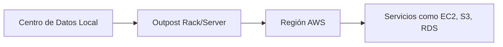
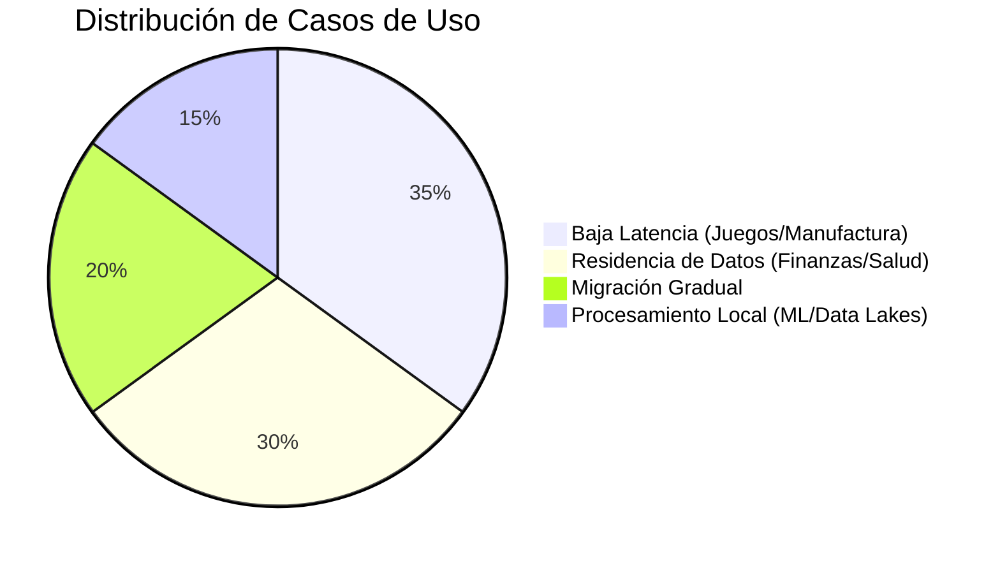

# **AWS Outposts: Infraestructura Híbrida en tus Instalaciones**

## **Introducción a AWS Outposts**
AWS Outposts es un servicio **híbrido** que lleva la infraestructura y servicios de AWS a instalaciones locales del cliente. Ofrece:
- **Mismo hardware, APIs y herramientas** que en la nube pública
- **Gestión 100% por AWS** (mantenimiento, actualizaciones)
- **Conectividad integrada** con regiones AWS

---

## **Componentes de AWS Outposts**
### **1. Outpost Rack**
- **Formato**: Bastidor estándar de 42U (1.75m de alto)
- **Capacidad**: Escalable de 1 a 96 racks
- **Casos de Uso**:
  - Migración gradual de aplicaciones
  - Procesamiento de datos sensibles localmente

### **2. Outpost Servers**
- **Para espacios reducidos**: Tiendas minoristas, fábricas
- **Servicios soportados**:
  - EC2, ECS, IoT Greengrass
  - Ideal para baja latencia (<10ms)

---

## **Servicios Disponibles en Outposts**
### **Tabla de Compatibilidad**
| **Categoría**          | **Servicios AWS Disponibles**                          |
|------------------------|-------------------------------------------------------|
| **Compute**            | EC2, ECS, EKS, App Mesh                               |
| **Storage**           | EBS, S3                                               |
| **Bases de Datos**     | RDS, ElastiCache (Redis/Memcached), EMR               |
| **Machine Learning**   | SageMaker, IoT Greengrass                             |
| **Redes**             | VPC, Application Load Balancer                        |

---

## **Beneficios Clave**
### **Lista de Ventajas**
1. **Consistencia**:
   - Mismas APIs/CLIs que en la nube pública.
2. **Baja Latencia**:
   - Procesamiento local para aplicaciones sensibles (ej: juegos multiplayer).
3. **Cumplimiento Normativo**:
   - Residencia de datos en ubicaciones específicas (ej: sector salud).
4. **Modelo Operativo Híbrido**:
   - Integración transparente con regiones AWS.

---

## **Casos de Uso Típicos**
### **Diagrama de Aplicaciones**

### **Ejemplos Detallados**
1. **Juegos en Tiempo Real**:
   - Renderizado gráfico con <5ms de latencia.
2. **Fabricación Inteligente**:
   - Análisis IoT en fábricas con datos locales.
3. **Sector Salud**:
   - Procesamiento de imágenes médicas cumpliendo HIPAA.
4. **Migración Faseada**:
   - Conexión híbrida durante transición a la nube.

---

## **Configuración Técnica**
### **Requisitos de Implementación**
- **Espacio Físico**:
  - Outpost Rack: Área con ventilación y energía redundante.
  - Servers: Espacios reducidos (ej: rack de 5U).
- **Conectividad**:
  - Enlace dedicado a AWS (Direct Connect recomendado).
- **Seguridad**:
  - AWS gestiona parches y monitoreo 24/7.

---

## **Comparativa: Outpost vs Soluciones On-Premise Tradicionales**
| **Aspecto**            | **AWS Outposts**                          | **Infraestructura Local Tradicional**      |
|------------------------|------------------------------------------|------------------------------------------|
| **Gestión**           | AWS maneja actualizaciones               | Equipo IT interno requerido              |
| **Escalabilidad**     | Escala bajo demanda                      | Capacidad fija                          |
| **Modelo de Costos**  | Pago por uso (OPEX)                     | Inversión inicial alta (CAPEX)           |
| **Integración Cloud** | Nativa con servicios AWS                | Requiere configuración manual            |

---

## **Conclusión**
AWS Outposts es ideal para organizaciones que necesitan:
✔ **Cumplir regulaciones** de residencia de datos.  
✔ **Aplicaciones sensibles a latencia** (ej: trading algorítmico).  
✔ **Migraciones híbridas** progresivas.  

📌 **Tip**: Combinar con **AWS Local Zones** para mayor cobertura geográfica.  

🔗 **Documentación**: [AWS Outposts](https://aws.amazon.com/es/outposts/)  

¡Extiende el poder de AWS a tus instalaciones con un modelo operativo unificado! 🏢🔌
