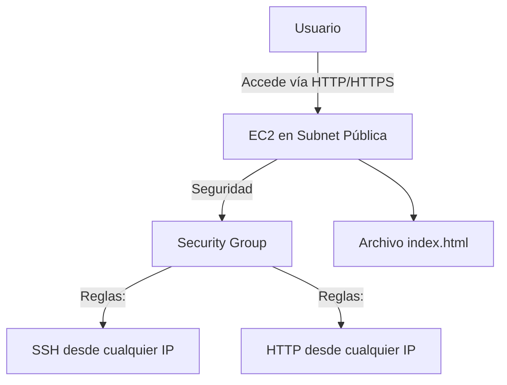

# **Guía Práctica: Implementación de un Servidor Web en EC2 con Apache**

## **Introducción**  
En este módulo práctico, aprenderemos a desplegar una instancia EC2 con servidor Apache en AWS. Este es un flujo fundamental para cualquier arquitecto de soluciones cloud. Aquí está el diagrama de arquitectura que implementaremos:



---

## **Paso a Paso: Laboratorio EC2 + Apache**

### **1. Acceso a AWS Console**  
1. **Ingresar a [AWS Academy](https://www.wizlabs.com/)** o la plataforma de entrenamiento.  
2. Navegar a:  
   ```plaintext
   AWS Certified Solutions Architect Associate → Labs → "Introduction to Amazon EC2"
   ```

### **2. Creación de la Instancia EC2**  

#### **Configuración Clave**  
| **Parámetro**       | **Valor**                | **Notas**                                  |
|----------------------|--------------------------|--------------------------------------------|
| **Nombre**          | `my-ec2-server`         | Identificador descriptivo.                |
| **AMI**             | Amazon Linux 2          | Gratis para niveles Free Tier.            |
| **Tipo de Instancia** | `t2.micro`             | Suficiente para pruebas básicas.          |
| **Key Pair**        | `whiskey-key` (RSA)    | Formato `.pem` para SSH.                  |

#### **Security Group (Critical!)**
```markdown
- **Nombre:** `my-ec2-server-SG`
- **Descripción:** "Security group to allow traffic to EC2"
- **Reglas de Entrada (Inbound Rules):**
  1. **SSH (22)**: Origen `0.0.0.0/0` (¡Solo para lab! En producción, restringir IPs).
  2. **HTTP (80)**: Origen `0.0.0.0/0`.
```

> ⚠️ **Advertencia:** En entornos reales, **NUNCA** habilites `0.0.0.0/0` para SSH. Usa IPs específicas o AWS Systems Manager (SSM).

---

### **3. Conexión SSH e Instalación de Apache**  

#### **Comandos Ejecutados**  
```bash
# 1. Actualizar paquetes
sudo yum update -y

# 2. Instalar Apache
sudo yum install httpd -y

# 3. Iniciar y habilitar Apache
sudo systemctl start httpd
sudo systemctl enable httpd

# 4. Verificar estado
sudo systemctl status httpd
```

#### **Publicar Página Web**  
```bash
# Crear contenido HTML
echo "<html><body><h1>¡Hola WizLabs! Soy una página pública.</h1></body></html>" | sudo tee /var/www/html/index.html

# Reiniciar Apache
sudo systemctl restart httpd
```

---

### **4. Validación y Buenas Prácticas**  

#### **Prueba de Funcionamiento**  
1. Copia la **IP Pública** de la instancia EC2.  
2. Accede desde un navegador:  
   ```
   http://<IP_PUBLICA>/index.html
   ```
   Deberías ver:  
   

#### **Eliminación de Recursos (Post-Lab)**  
- **Siempre** termina/destruye los recursos después del lab para evitar costos innecesarios:  
  ```markdown
  1. Detén/termina la instancia EC2.
  2. Elimina el Security Group creado.
  3. Borra el Key Pair (opcional, pero recomendado).
  ```

---

## **Errores Comunes y Soluciones**  
| **Error**                     | **Causa**                          | **Solución**                              |
|-------------------------------|------------------------------------|------------------------------------------|
| "Connection timed out" (SSH)  | Security Group no permite SSH.     | Verificar reglas de inbound.             |
| Apache no inicia              | Paquete no instalado correctamente.| Ejecutar `sudo yum install httpd -y` nuevamente. |
| Página no carga (HTTP 403)    | Permisos en `/var/www/html/`.      | `sudo chmod 644 /var/www/html/index.html` |

---

## **Conclusión**  
Este laboratorio cubre:  
✅ **Despliegue básico de EC2** (AMI, tipos de instancia, Key Pairs).  
✅ **Configuración de Security Groups** (balanceando seguridad y accesibilidad).  
✅ **Automatización con CLI** (instalación de Apache y publicación web).  

**¡Practica este flujo!** Es la base para implementar servidores web, APIs, o incluso aplicaciones empresariales en AWS.  
