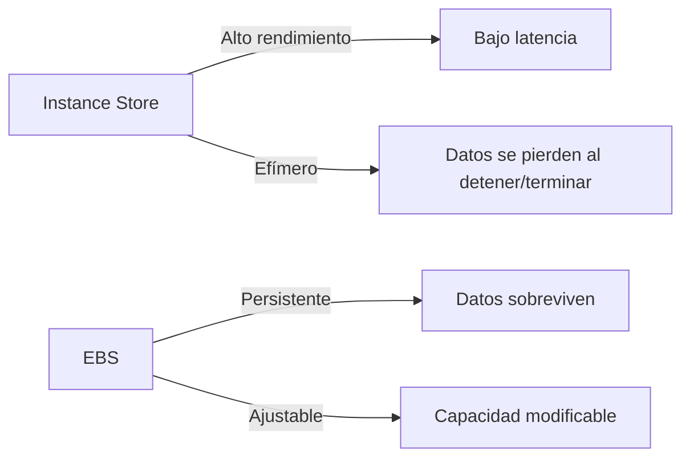

# **Almacenamiento Efímero en EC2: Entendiendo el Instance Store**

## **Introducción**  
El **Instance Store** de Amazon EC2 es un tipo de almacenamiento temporal de alto rendimiento directamente acoplado a la instancia. A diferencia de EBS (persistente), este almacenamiento es volátil y se elimina cuando la instancia se detiene o termina.  

### **Diagrama Comparativo: Instance Store vs. EBS**  


---

## **Características Clave del Instance Store**  

### **Tabla: Pros y Contras**  
| **Ventajas**                          | **Limitaciones**                     |
|---------------------------------------|--------------------------------------|
| ⚡ **Baja latencia** (nanosegundos).  | 🚫 **No persistente** (datos temporales). |
| 🚀 **Alto throughput** (hasta millones de IOPS). | 📏 **Capacidad fija** (no escalable). |
| 💰 **Sin costo adicional** (incluido en el precio de la instancia). | 🖥️ **No apto para volumen de arranque** (solo almacenamiento secundario). |

### **Casos de Uso Ideales**  
- **Buffer de caché** (ej: Redis, Memcached).  
- **Espacio temporal** (ej: procesamiento de archivos grandes).  
- **Datos regenerables** (ej: logs temporales, cálculos intermedios).  

> 📌 **Regla de oro:** Nunca almacenes datos críticos aquí sin estrategia de backup.

---

## **Consideraciones Técnicas**  

### **Lista: Qué Verificar al Usar Instance Store**  
1. **Compatibilidad**: No todos los tipos de instancia lo soportan (ej: `t2.micro` no, mientras que `i3.large` sí).  
2. **Configuración**:  
   - Se define en el **Block Device Mapping** al lanzar la instancia.  
   - Ejemplo en AWS CLI:  
     ```bash
     aws ec2 run-instances --block-device-mappings "DeviceName=/dev/sdb,VirtualName=ephemeral0"
     ```  
3. **Rendimiento**: Varía según el tipo de instancia (ej: instancias de la familia `i3` ofrecen NVMe).  

### **Ejemplo: Especificaciones por Familia**  
| **Familia de Instancias** | **Tecnología** | **Máx. Capacidad** | **IOPS Máximos** |
|---------------------------|----------------|--------------------|------------------|
| `i3`                      | NVMe           | 15.2 TB            | 3,300,000        |
| `m5d`                     | SSD            | 3.6 TB             | 600,000          |

---

## **Mejores Prácticas**  

### **Lista Ordenada: Diseño para Datos Efímeros**  
1. **Replicación en caliente**: Usa EBS o S3 para backups automáticos de datos críticos.  
2. **Tolerancia a fallos**: Diseña aplicaciones que puedan regenerar datos perdidos.  
3. **Monitoreo**: Emplea Amazon CloudWatch para alertar sobre uso del almacenamiento.  
4. **Selección de instancia**: Elige familias optimizadas (ej: `i3`, `m5d`) si necesitas alto rendimiento.  

### **Advertencia Crítica**  
> ❗ **"Terminar" una instancia con Instance Store = Pérdida irreversible de datos.**  
> Usa el estado **"Detener"** (Stop) si necesitas preservar la instancia (pero no los datos).

---

## **Conclusión**  
El **Instance Store** es una herramienta poderosa para cargas de trabajo que requieren:  
- **Velocidad extrema** (latencia mínima).  
- **Costos optimizados** (sin cargos adicionales).  

**Recomendación final:**  
> Combínalo con **EBS** o **S3** para persistencia, y úsalo estratégicamente en arquitecturas de microservicios, Big Data o caching.  
