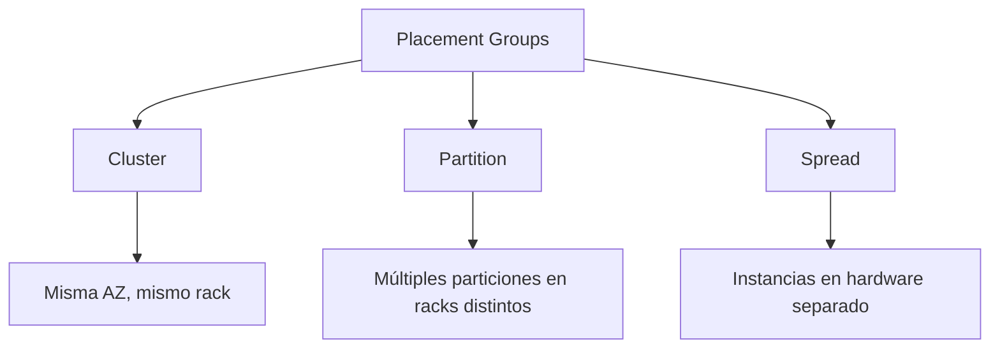
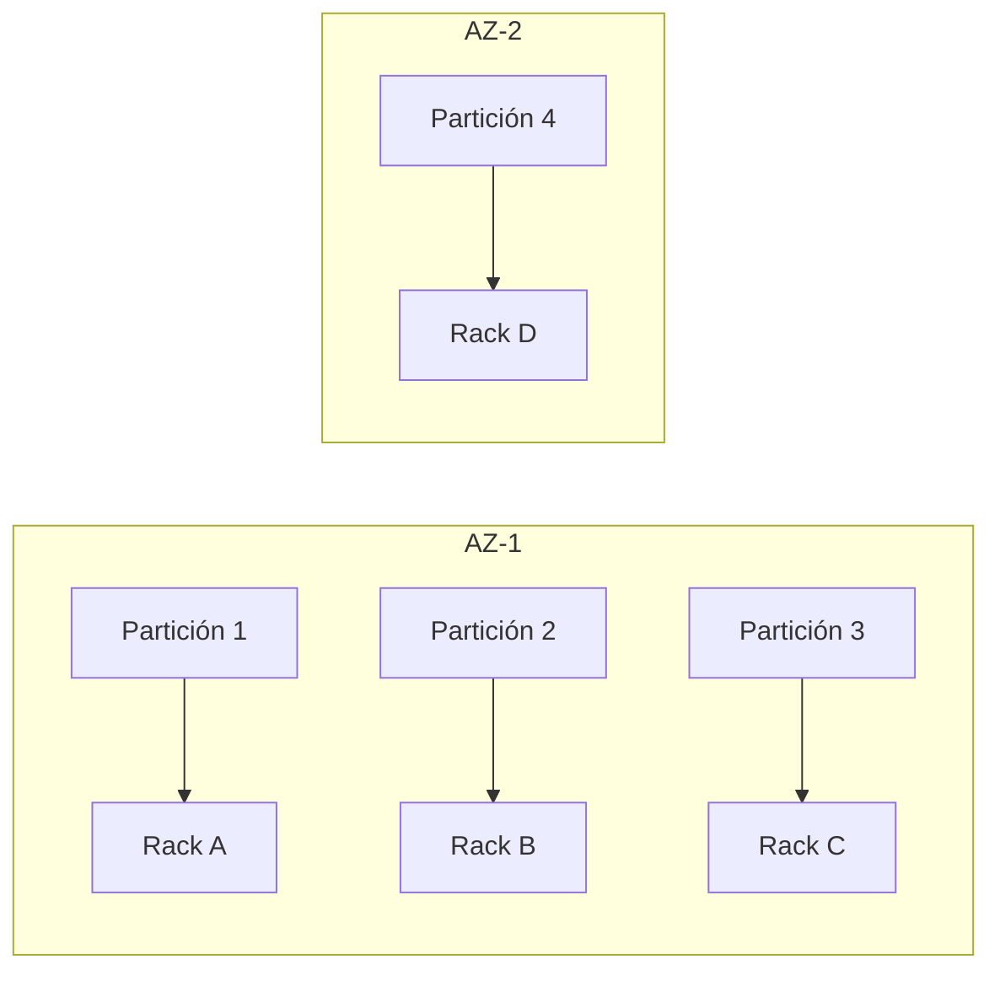

# **Grupos de Colocación en AWS: Optimización de Despliegue de Instancias EC2**

## **Introducción a los Placement Groups**
Los grupos de colocación (Placement Groups) son una funcionalidad de AWS que permite controlar cómo se distribuyen las instancias EC2 en la infraestructura subyacente. Su objetivo principal es optimizar el rendimiento de red y minimizar fallos correlacionados.

### **Beneficios Clave**
- 🚀 **Menor latencia y mayor throughput** entre instancias
- 🛡️ **Reducción de impacto por fallos de hardware**
- 🧩 **Soporte para aplicaciones distribuidas** (HDFS, Cassandra, HBase)
- 🌐 **Flexibilidad para distribuir en múltiples AZs**

## **Tipos de Placement Groups**

### **Tabla Comparativa**
| Tipo | Descripción | Casos de Uso | Limitaciones |
|------|------------|--------------|--------------|
| **Cluster** | Agrupa instancias en el mismo rack para máxima velocidad | Cargas que requieren baja latencia (HPC, Big Data) | Máx. 1 AZ, mismo tipo de instancia recomendado |
| **Partition** | Divide en particiones lógicas (cada una en racks distintos) | Bases de datos distribuidas (Cassandra, Kafka) | 7 particiones por AZ |
| **Spread** | Distribuye instancias en hardware independiente | Aplicaciones críticas que evitan SPOF | Máx. 7 instancias por AZ |

## **Recomendaciones de Uso**

### **Lista de Mejores Prácticas**
1. **Para aplicaciones sensibles a latencia** (HPC, gaming):
   - Usar **Cluster Placement Groups**
   - Seleccionar instancias con Enhanced Networking

2. **Para aplicaciones distribuidas tolerantes a fallos**:
   - Implementar **Partition Placement Groups**
   - Máximo 7 particiones por AZ

3. **Para cargas críticas que requieren aislamiento**:
   - Emplear **Spread Placement Groups**
   - Ideal para mezclar tipos de instancias

### **Limitaciones Importantes**
- ❗ 500 grupos de colocación por cuenta/región
- ❗ No se pueden fusionar grupos existentes
- ❗ Una instancia solo puede estar en un grupo a la vez
- ❗ Para Cluster Groups: ancho de banda de 10Gbps por flujo

## **Ejemplo de Arquitectura con Partition Groups**

## **Conclusión**
Los Placement Groups son esenciales para:
- Optimizar **rendimiento de red** entre instancias
- Garantizar **alta disponibilidad** en aplicaciones distribuidas
- Cumplir con **requerimientos específicos** de colocación

**Recomendación final:** Analice sus patrones de tráfico y requisitos de resiliencia antes de seleccionar el tipo de grupo. Combine estratégicamente con múltiples AZs para máxima disponibilidad.
