# **Kit Completo: Placement Groups en AWS EC2**

## 📊 **Infografía Resumen**


**Leyenda:**
- 🟠 **Cluster**: HPC, Big Data
- 🟢 **Partition**: Cassandra, Kafka
- 🟣 **Spread**: Cargas críticas

---

## 📋 **Cheat Sheet Rápido**

### **Cuándo Usar Cada Tipo**
| **Tipo** | **Recomendado Para** | **NO Usar Para** |
|----------|----------------------|------------------|
| **Cluster** | MPI, Hadoop, Rendering 3D | Alta disponibilidad |
| **Partition** | Bases de datos distribuidas | Latencia ultrabaja |
| **Spread** | Servidores críticos | Grupos >7 instancias/AZ |

### **Límites Clave**
```markdown
- ✔ Máx. 500 grupos/cuenta/región
- ✔ Cluster: Mismo tipo de instancia (recomendado)
- ✖ Spread no compatible con Dedicated Instances
```

---

## 🖥 **Casos de Uso Reales con Diagramas**

### **1. Plataforma de Trading (Cluster Group)**

```mermaid
graph LR
    T[Terminales Trading] --> C[Cluster Placement Group]
    C -->|1μs latency| S1[Servidor 1]
    C --> S2[Servidor 2]
    C --> S3[Servidor 3]
```

**Beneficio:** Latencia mínima para operaciones en milisegundos.

### **2. Cassandra Multi-AZ (Partition Group)**

```mermaid
graph TD
    P1[Partición 1\nAZ-A] --> N1[Nodo 1]
    P1 --> N2[Nodo 2]
    P2[Partición 2\nAZ-B] --> N3[Nodo 3]
```

**Patrón:** 3 particiones across AZs + RF=3 para tolerancia a fallos.

### **3. Servidores Críticos (Spread Group)**

**Ventaja:** Ningún fallo de rack afecta >1 instancia.

---

## 🛠 **Plantilla para Decisiones**
```markdown
1. ¿Requiere latencia <1ms? → **Cluster**
2. ¿Necesita aislamiento de fallos? → **Partition**
3. ¿Son instancias críticas? → **Spread**
4. ¿Supera 7 instancias/AZ? → Combinar **Partition+Spread**
```
