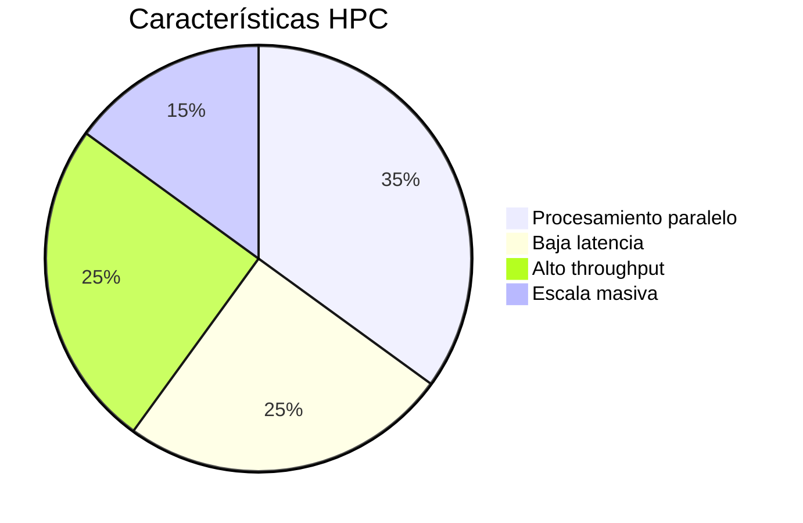
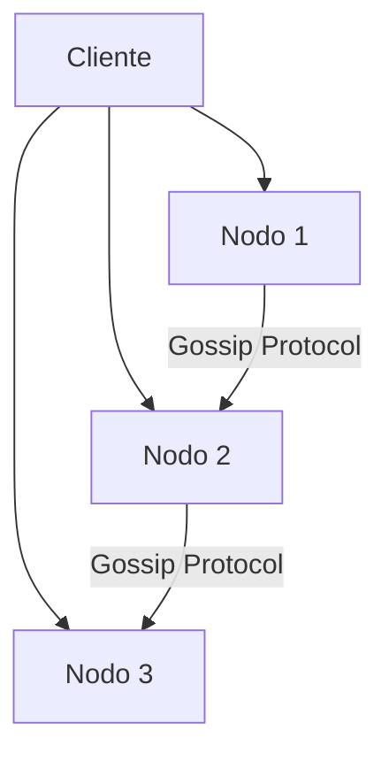
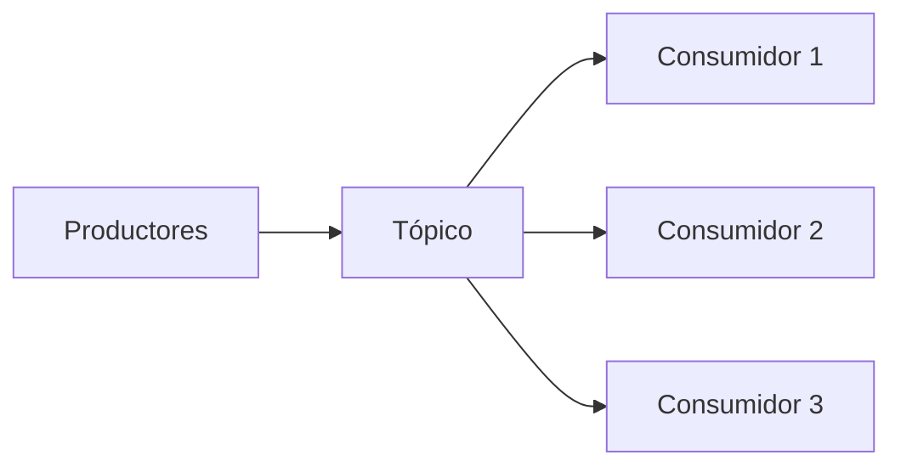
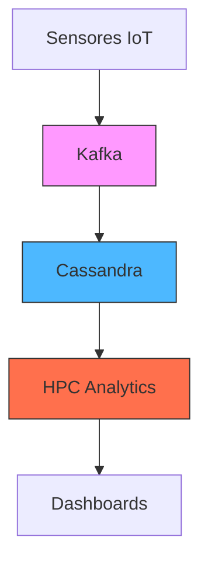

# **Guía Completa: HPC, Cassandra y Kafka en AWS**

## **1. HPC (High Performance Computing)**
### **¿Qué es?**
Sistemas diseñados para resolver problemas complejos que requieren **cálculos masivos** y **alto poder computacional**.

### **Características Clave**


### **Casos de Uso en AWS**
- 🧪 **Simulaciones científicas** (clima, genómica)
- 🛢️ **Análisis de yacimientos petroleros**
- 🚀 **Diseño aeroespacial** (CFD - Dinámica de Fluidos)
- 🧬 **Modelado molecular** (farmacéutica)

### **Configuración AWS Óptima**
```markdown
- **Instancias:** C5n.18xlarge (100Gbps networking)
- **Placement Group:** Cluster (para baja latencia)
- **Servicios Adicionales:** AWS ParallelCluster, EFA (Elastic Fabric Adapter)
```

---

## **2. Apache Cassandra**
### **¿Qué es?**
Base de datos **NoSQL distribuida** diseñada para manejar grandes volúmenes de datos en múltiples servidores.

### **Arquitectura Típica**


### **Ventajas Clave**
- 📈 **Escalabilidad lineal** (añade nodos fácilmente)
- 🛡️ **Tolerancia a fallos** (datos replicados en múltiples nodos)
- 🌐 **Multi-AZ/Multi-Region** nativo

### **Casos de Uso Comunes**
- 🛒 **Carritos de compra** (alta disponibilidad)
- 📱 **Mensajería en tiempo real**
- 📍 **Sistemas de geolocalización**

### **Configuración AWS Recomendada**
```markdown
- **Placement Group:** Partition (para aislamiento de fallos)
- **Instancias:** i3.4xlarge (alto IOPS SSD)
- **Storage:** EBS gp3 o instancias storage-optimized
```

---

## **3. Apache Kafka**
### **¿Qué es?**
Plataforma de **streaming de eventos** distribuida que funciona como cola de mensajería pub/sub de alta velocidad.

### **Flujo Básico**


### **Beneficios Principales**
- ⚡ **Procesamiento en tiempo real**
- 🔄 **Retención de mensajes** (configurable)
- 🌍 **Integración multi-sistema**

### **Casos Típicos**
- 📊 **Analítica en tiempo real** (clicks, logs)
- 🔗 **Integración de microservicios**
- 🛒 **Sincronización de inventarios**

### **Configuración AWS**
```markdown
- **Placement Group:** Partition (para distribuir brokers)
- **Instancias:** m5.2xlarge (balance CPU/memoria)
- **Servicio Managed:** MSK (Managed Streaming for Kafka)
```

---

## **Tabla Comparativa: HPC vs Cassandra vs Kafka**
| **Criterio**       | **HPC**               | **Cassandra**         | **Kafka**             |
|--------------------|-----------------------|-----------------------|-----------------------|
| **Tipo de Carga**  | Cálculos intensivos   | Datos distribuidos    | Eventos/Streaming     |
| **Escalabilidad**  | Vertical/Horizontal   | Horizontal            | Horizontal            |
| **Latencia**       | Microsegundos         | Milisegundos          | Milisegundos          |
| **Ejemplo AWS**    | C5n.18xlarge + EFA    | i3.4xlarge + EBS      | m5.2xlarge + MSK      |

---

## **Diagrama de Arquitectura Combinada**


**Flujo:**
1. Dispositivos envían datos a Kafka
2. Cassandra almacena datos históricos
3. HPC procesa análisis complejos
4. Resultados a visualización
