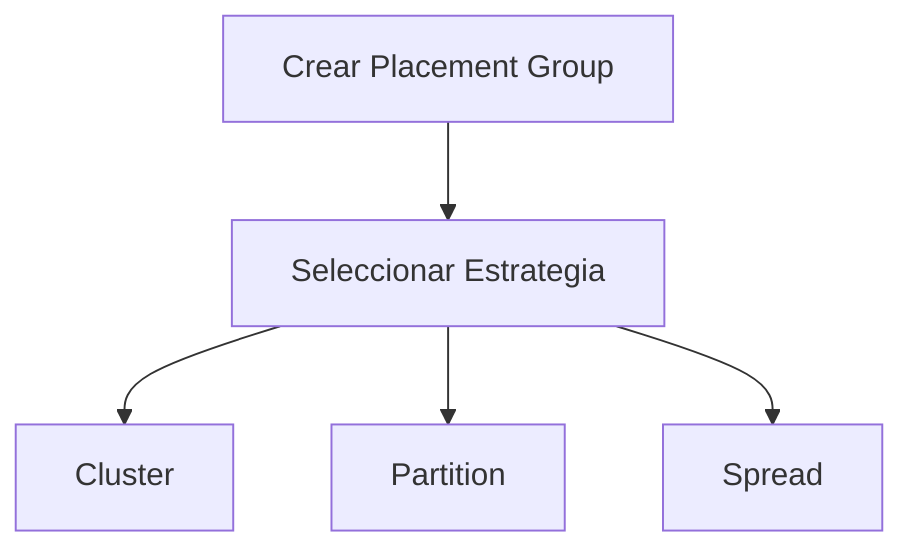
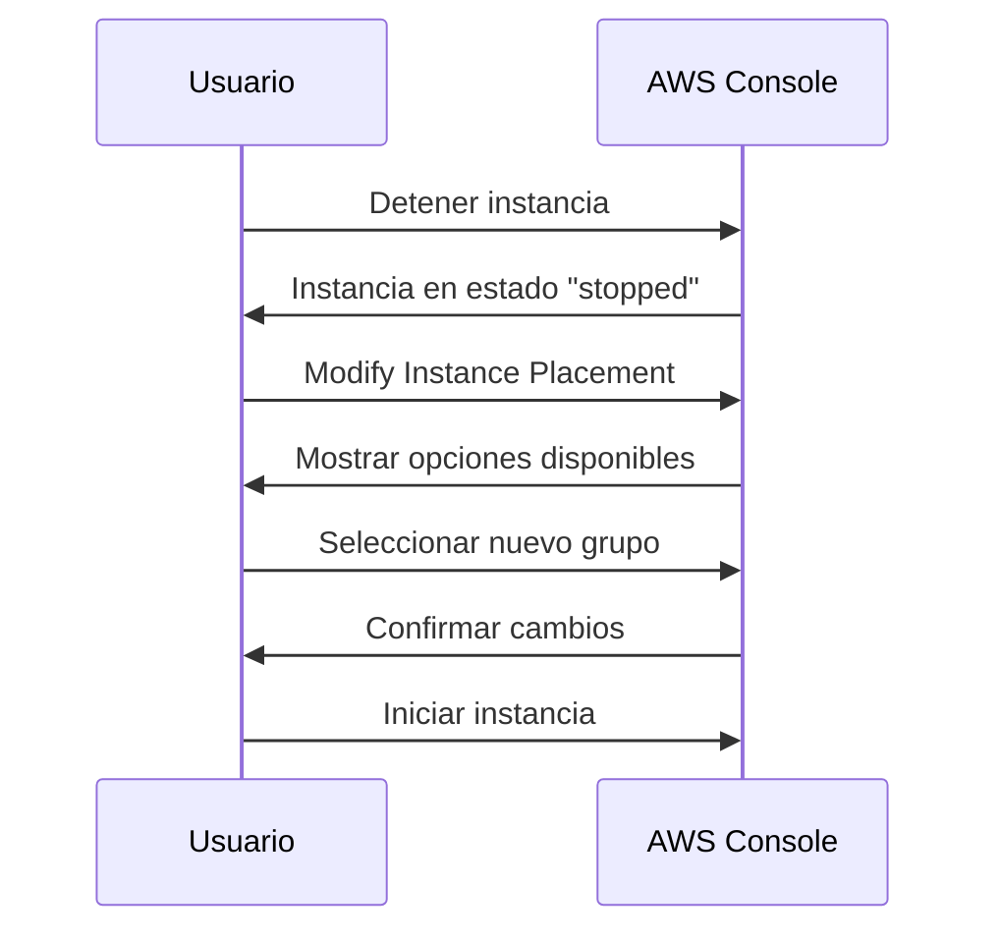

# **Demostración Práctica: Grupos de Colocación en EC2**

## **Introducción**
En esta demostración, exploraremos cómo crear, asignar y gestionar **Placement Groups** en AWS EC2, utilizando la consola de AWS. Los Placement Groups son fundamentales para optimizar el rendimiento de red y la tolerancia a fallos en arquitecturas distribuidas.

---

## **Pasos Detallados**

### **1. Creación de Placement Groups**
Vamos a crear tres tipos de grupos con diferentes estrategias:

| **Tipo de Grupo** | **Nombre**          | **Configuración**                     |
|-------------------|---------------------|---------------------------------------|
| Cluster           | `demo-cluster-pgrp` | Estrategia "Cluster"                  |
| Partition         | `demo-part-pgrp`    | Estrategia "Partition" (2 particiones)|
| Spread            | `demo-spread-pgrp`  | Estrategia "Spread" (nivel rack)      |



---

### **2. Asignación a Instancias EC2**
**Proceso clave:**
1. **Selección de instancia compatible**: No todos los tipos de instancia funcionan con todos los grupos (ej: `t2.micro` no es compatible con Cluster).
2. **Asignación en "Advanced Details"**:
   - Navegar a la pestaña de configuración avanzada.
   - Seleccionar el Placement Group deseado.

**Ejemplo con Partition Group:**
```markdown
1. Seleccionar `demo-part-pgrp`.
2. Elegir partición (ej: Partición 1 de 2).
3. Lanzar instancia.
```

---

### **3. Gestión y Modificación**
#### **Operaciones Comunes**
| **Acción**                     | **Requisitos**               | **Pasos**                                                                 |
|--------------------------------|-----------------------------|---------------------------------------------------------------------------|
| Cambiar Placement Group       | Instancia **detenida**      | `Instance Actions` > `Modify Instance Placement` > Seleccionar nuevo grupo|
| Remover de Placement Group    | Instancia **detenida**      | `Modify Instance Placement` > Seleccionar "None"                          |
| Eliminar Placement Group      | Sin instancias asociadas    | `Actions` > `Delete Placement Group`                                      |

> ⚠️ **Importante:** Siempre verificar la compatibilidad del tipo de instancia con la estrategia del grupo.

---

## **Diagrama de Flujo: Modificación de Placement Group**


---

## **Errores Comunes y Soluciones**
| **Error**                          | **Causa**                          | **Solución**                            |
|------------------------------------|------------------------------------|-----------------------------------------|
| "Unsupported instance type"        | Tipo de instancia incompatible    | Usar instancias compatibles (ej: `m5.xlarge`) |
| "Insufficient capacity"            | No hay recursos disponibles       | Intentar en otra AZ o cambiar tipo de instancia |
| "Cannot modify running instance"   | Instancia en estado "running"     | Detener la instancia primero            |

---

## **Conclusión**
- **Placement Groups** son esenciales para cargas de trabajo sensibles a latencia o alta disponibilidad.
- **Siempre validar compatibilidad** entre tipo de instancia y estrategia de grupo.
- **Planificar con anticipación**: Cambios requieren detener instancias.
