# **Arquitectura Cassandra Multi-AZ con Partition Groups en AWS**

## **Diagrama de Arquitectura Global**


## **Paso a Paso Detallado**

### **1. Configuración Inicial**
#### **Requisitos Previos**
- Acceso a AWS Console con permisos de EC2, VPC y IAM
- Mismo VPC en las 3 AZs
- Security Groups configurados para:
  - Puerto 9042 (CQL)
  - Puerto 7000 (Comunicación nodos)
  - SSH (opcional para administración)


### **2. Creación del Partition Placement Group**
1. **En AWS Console**:
   - Navegar a EC2 > Placement Groups > Create
   - Nombre: `cassandra-pg`
   - Estrategia: **Partition**
   - Número de particiones: `3` (1 por AZ)
   - Tags: `Name=cassandra-nodes`

```markdown
📌 Nota: AWS distribuirá automáticamente cada partición en racks físicos distintos con:
- Alimentación independiente
- Redes separadas
```

### **3. Lanzamiento de Instancias i3en**
**Configuración por Nodo**:
| Parámetro              | Valor                          |
|------------------------|--------------------------------|
| AMI                    | Amazon Linux 2 (Cassandra Optimized) |
| Instance Type          | i3en.2xlarge (8 vCPU, 64GB RAM, 2x NVMe) |
| Placement Group        | `cassandra-pg` + Partición correspondiente |
| Storage                | NVMe local (no EBS necesario) |
| User Data              | Script de instalación Cassandra |

**Distribución por AZ**:


### **4. Configuración de Cassandra**
**Archivo `cassandra.yaml` clave**:
```yaml
cluster_name: 'CassandraMultiAZ'
endpoint_snitch: GossipingPropertyFileSnitch
seeds: "ip_nodo1,ip_nodo2"
auto_bootstrap: true
num_tokens: 256
```

**Topología por Rack (Critical!)**:
```bash
# En cada nodo:
echo "dc=aws_east_1
rack=partition_1" > /etc/cassandra/cassandra-rackdc.properties
```

### **5. Inicialización del Cluster**
1. **Secuencia de Arranque**:
   ```mermaid
   sequenceDiagram
       Nodo1->>Nodo2: seed1 (AZ-A)
       Nodo3->>Nodo1: seed2 (AZ-B)
       Nodo5->>Nodo1: seed3 (AZ-C)
       loop Join Cluster
           Nodo4->>Nodo2: Unirse
           Nodo6->>Nodo3: Unirse
       end
   ```

2. **Verificación**:
   ```bash
   nodetool status
   ```
   Salida esperada:
   ```
   Datacenter: aws_east_1
   =======================
   Status=Up/Down
   |/ State=Normal/Leaving/Joining/Moving
   --  Address     Load       Tokens  Owns   Host ID       Rack
   UN  10.0.1.10   1.45 TB    256     ?      uuid1        partition_1
   UN  10.0.2.20   1.39 TB    256     ?      uuid2        partition_2
   ```

## **Esquema de Tolerancia a Fallos**

```mermaid
graph LR
    F[Fallos] -->|AZ completa| P1[Partición 1]
    F -->|Rack físico| P2[Partición 2]
    P1 -->|Réplicas| P3[Partición 3]
    style F stroke:#ff0000,stroke-width:2px
```


**Estrategia de Replicación**:
```sql
CREATE KEYSPACE my_keyspace 
WITH REPLICATION = {
   'class': 'NetworkTopologyStrategy',
   'aws_east_1': '3' 
};
```

## **Monitoreo y Optimización**
**CloudWatch Metrics Clave**:
1. `WriteLatency` < 5ms
2. `ReadLatency` < 10ms
3. `CompactionPendingTasks` < 10

**Configuración NVMe**:
```bash
# Formateo y montaje de NVMe
mkfs.ext4 /dev/nvme1n1
mount -o noatime /dev/nvme1n1 /var/lib/cassandra
```

## **Costos Estimados (us-east-1)**
| Componente          | Costo Mensual (6 nodos) |
|---------------------|-------------------------|
| i3en.2xlarge        | $1,944 ($0.45/hr x 6)   |
| Transferencia Datos | ~$120 (10TB inter-AZ)   |
| **Total**           | **$2,064**              |

## **Conclusión**
Esta arquitectura proporciona:
- ✅ **Alta disponibilidad** (supervivencia a fallos de AZ completa)
- ⚡ **Máximo rendimiento** (NVMe local + networking optimizado)
- 📈 **Escalabilidad horizontal** (añade nodos a particiones existentes)

**Recomendación final**:  
Implementa backup periódicos a S3 usando `nodetool snapshot` y prueba simulaciones de fallos con `chaos-monkey`.

**Si quieres llevar esto al siguiente nivel:**

1. **Auto-Scaling con Custom Metrics**  
   Usa **AWS Managed Service for Prometheus** para escalar nodos basado en:
   ```python
   # Ejemplo de métrica personalizada
   if disk_io_wait > 70%:
       add_node_to_partition()
   ```

2. **Terraform para IaC**  
   Aquí tienes el snippet clave para los Placement Groups:
   ```hcl
   resource "aws_placement_group" "cassandra" {
     name     = "cassandra-pg"
     strategy = "partition"
     partition_count = 3
   }
   ```

