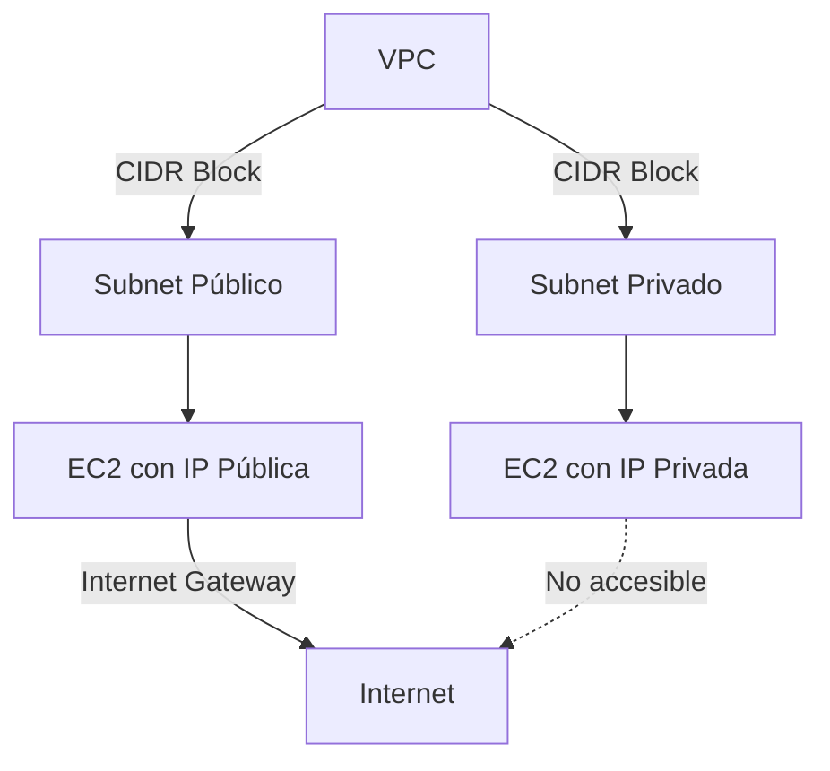
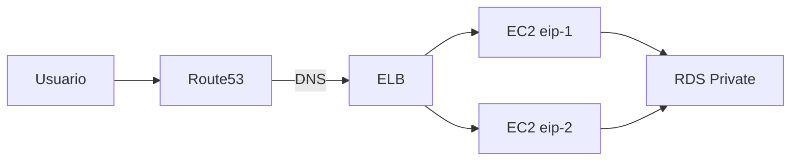

# **Direccionamiento IP en AWS: Público, Privado y Elástico**

## **Conceptos Clave para el Examen de Arquitecto AWS**

### **1. Tipos de Direcciones IP en VPC**
| **Tipo**       | **Alcance**       | **Persistencia** | **Costo**          | **Uso Típico**               |
|----------------|------------------|------------------|--------------------|-----------------------------|
| **Privada**    | Solo dentro de VPC | Persistente      | Sin costo          | Comunicación interna         |
| **Pública**    | Internet          | No persistente   | Sin costo*         | Acceso temporal desde internet |
| **Elástica**   | Internet          | Persistente      | Cobro si no se usa | Servicios públicos críticos  |



### **2. Comparación IPv4 vs IPv6**
**Diferencias Clave**:

#### **IPv4**
- **Bloque CIDR VPC**: /16 a /28
- **Subnets**: /16 a /28
- **Tipos**:
  - Privadas (RFC 1918)
  - Públicas (NAT required)
- **Elastic IP**: ✔️ Soportado

#### **IPv6**
- **Bloque CIDR VPC**: Fijo /56
- **Subnets**: Fijo /64
- **Tipos**: Todas son públicas
- **Elastic IP**: ❌ No soportado

> 📌 **Importante para el examen**: AWS cobra por IPs Elásticas no asignadas ($0.005/hr)

### **3. Configuración Práctica**
#### **Asignación de IPs**
1. **IP Pública Automática**:
   - Activada a nivel de subnet o durante el lanzamiento
   - Cambia al reiniciar la instancia
   ```bash
   aws ec2 run-instances --subnet-id subnet-123 --associate-public-ip-address
   ```

2. **IP Elástica**:
   - Asociación manual a instancias
   - Persiste entre reinicios
   ```bash
   aws ec2 allocate-address --domain vpc
   aws ec2 associate-address --instance-id i-123 --allocation-id eipalloc-123
   ```

#### **Ejemplo de Arquitectura**


### **4. Buenas Prácticas**
- **Para alta disponibilidad**:
  - Usar IPs Elásticas + Route53 Failover
  - Ejemplo de recuperación ante fallos:
    ```bash
    aws ec2 disassociate-address --association-id eipassoc-123
    aws ec2 associate-address --instance-id i-456 --allocation-id eipalloc-123
    ```

- **Seguridad**:
  - Restringir IPs públicas con Security Groups
  - Usar NAT Gateway para salida a internet desde subnets privadas

### **5. Escenarios de Examen Comunes**
❓ *"Una aplicación requiere una dirección IP constante para whitelisting. ¿Qué solución recomienda?"*  
✅ **Respuesta**: Asignar una IP Elástica y configurar un Health Check en Route53.

❓ *"¿Cómo reducir costos en direcciones IP no utilizadas?"*  
✅ **Respuesta**: Liberar IPs Elásticas no asignadas.

---

## **Conclusión**
- **IPs Públicas**: Ideales para recursos temporales
- **IPs Elásticas**: Esenciales para servicios críticos
- **IPv6**: Útil para escalabilidad global (pero sin Elastic IP)
