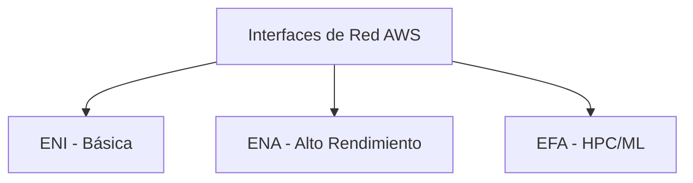
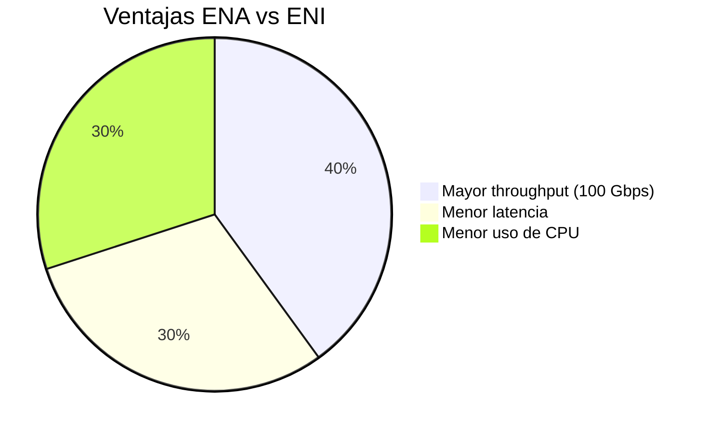
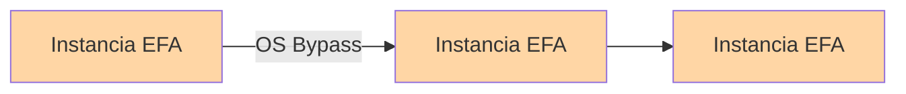

# **Interfaces de Red en AWS: ENI, ENA y EFA - Guía Completa para Arquitectos**

## **Introducción a las Interfaces de Red en EC2**
AWS ofrece tres tipos de interfaces de red para instancias EC2, cada una con características únicas para diferentes cargas de trabajo:



## **1. Elastic Network Interface (ENI) - Básica**
### **Características Clave**
- **Virtual NIC estándar** en VPC
- **Soporte para**:
  - 1 dirección IPv4 primaria
  - Múltiples IPv4 secundarias
  - 1 Elastic IP por IPv4 privada
  - Direcciones IPv6
  - Múltiples Security Groups
  - Dirección MAC única

### **Tabla: Casos de Uso ENI**
| **Ventajas** | **Limitaciones** | **Instancias Compatibles** |
|--------------|------------------|---------------------------|
| Soporte universal | Ancho de banda moderado | Todas las instancias EC2 |
| Ideal para webservers/databases | Latencia estándar | |
| Configuración flexible | | |

## **2. Elastic Network Adapter (ENA) - Alto Rendimiento**
### **Mejoras sobre ENI**


### **Detalles Técnicos**
- **Tecnología**: SR-IOV (Single Root I/O Virtualization)
- **Implementaciones**:
  1. Adaptador ENA (hasta 100 Gbps)
  2. Interfaz Intel 82599 VF (hasta 100 Gbps)

**Ejemplo de configuración CLI**:
```bash
aws ec2 run-instances \
    --instance-type c5n.4xlarge \  # Instancia compatible con ENA
    --network-interfaces "DeviceIndex=0,InterfaceType=ena"
```

## **3. Elastic Fabric Adapter (EFA) - HPC/ML**
### **Diferencias Clave con ENA**
| **Característica** | **ENA** | **EFA** |
|--------------------|---------|---------|
| OS Bypass | No | Sí |
| Ancho de banda | Hasta 100 Gbps | Hasta 400 Gbps |
| Routable entre subnets | Sí | Solo modo no-OS-bypass |
| Casos de uso | Streaming, big data | ML, CFD, simulaciones |

### **Arquitectura típica para HPC**

*Nota: Todas las instancias deben estar en la misma subnet cuando se usa OS Bypass*

## **Guía de Selección**
**¿Cuál interface necesito?**
1. **ENI**: 
   - Aplicaciones generales (webservers, APIs)
   - Todos los tipos de instancia

2. **ENA**:
   - Big Data (Hadoop, Spark)
   - Streaming de video
   - Instancias optimizadas (c5n, i3en, etc.)

3. **EFA**:
   - Aprendizaje automático distribuido
   - Dinámica de fluidos computacional (CFD)
   - Simulaciones financieras

## **Limitaciones Importantes**
- **Compatibilidad**:
  - ENA: Solo instancias HVM
  - EFA: Instancias específicas (p4d, c6gn)

- **Consideraciones de red**:
  ```mermaid
  flowchart LR
      EFA_Mode[Modo EFA] -->|OS Bypass| SameSubnet[Misma subnet]
      EFA_Mode -->|IP Tradicional| CrossSubnet[Routing entre subnets]
  ```

## **Conclusión**
- **ENI** es la opción por defecto para cargas generales
- **ENA** ofrece mejor rendimiento para aplicaciones sensibles a latencia
- **EFA** es especializada para cargas HPC/ML con requisitos extremos

**¿Próximos pasos?** Prueba estas configuraciones en:
- Clústeres MPI con EFA
- Flujos de datos ETL con ENA
- Arquitecturas serverless con ENI
