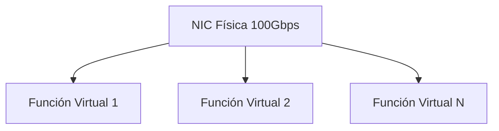
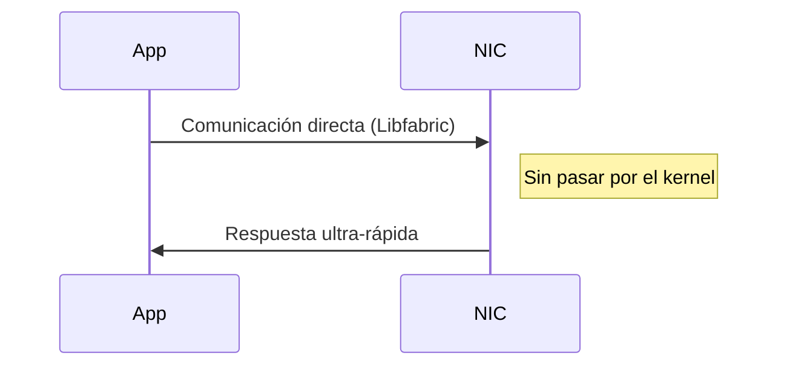

# **Conceptos Clave de Redes Avanzadas en AWS**

## **1. SR-IOV (Single Root I/O Virtualization)**
### **Definición**
Tecnología de virtualización que permite a **una tarjeta de red física (NIC)** dividirse en múltiples interfaces virtuales ("funciones virtuales"), cada una con acceso directo al hardware.

### **Cómo Funciona**


### **Beneficios vs Virtualización Tradicional**
| **Parámetro**       | **SR-IOV**         | **Virtualización Estándar** |
|----------------------|--------------------|----------------------------|
| Latencia             | Microsegundos      | Milisegundos               |
| Throughput           | 100% del hardware  | 30-50% por overhead        |
| Uso CPU              | Casi 0%            | Alto (20-30%)              |

**Ejemplo en AWS**:
- Instancias `c5n.18xlarge` usan SR-IOV para alcanzar **100Gbps de ancho de banda**.
- Caso de uso: Procesamiento de video en tiempo real con Amazon Interactive Video Service.

## **2. Throughput**
### **Definición**
Cantidad de datos transmitidos por unidad de tiempo (generalmente medido en **Gbps** o **Mbps**).

### **Ejemplos Prácticos**
| **Escenario**                | **Throughput Típico** | **Ejemplo AWS**           |
|------------------------------|-----------------------|---------------------------|
| Streaming 4K                 | 25 Mbps por usuario  | Amazon CloudFront         |
| Transferencia de datos HPC   | 100 Gbps             | EC2 con EFA (p4d.24xlarge)|
| Base de datos transaccional  | 5 Gbps               | RDS PostgreSQL con ENA    |

**Fórmula Clave**:
```
Throughput efectivo = (Tamaño del paquete * 8 bits) / Latencia
```

## **3. OS Bypass**
### **Definición**
Mecanismo donde las **aplicaciones acceden directamente al hardware de red**, evitando el kernel del sistema operativo para reducir latencia.

### **Arquitectura**


### **Casos de Uso**
1. **Machine Learning Distribuido**:
   - Framework: TensorFlow con GPUDirect RDMA
   - Ejemplo AWS: Clúster `p4d.24xlarge` + EFA

2. **Simulaciones Financieras**:
   - Tecnología: MPI (Message Passing Interface)
   - Latencia típica: <10 μs

3. **Bases de Datos In-Memory**:
   - Ejemplo: Amazon ElastiCache for Redis con throughput de 100Gbps

## **Comparativa Integral**
| **Concepto**  | **Ventaja Principal**       | **Limitación**               | **Servicio AWS Relacionado** |
|---------------|-----------------------------|------------------------------|------------------------------|
| **SR-IOV**    | Máximo rendimiento hardware | Solo instancias específicas  | EC2 Optimizado (c5n, i3en)   |
| **Throughput**| Capacidad de transferencia  | Depende de ancho de banda    | ENA (hasta 100Gbps)          |
| **OS Bypass** | Latencia ultra-baja         | Solo aplicaciones compatibles| EFA (Elastic Fabric Adapter) |

## **Ejemplo de Configuración EFA con OS Bypass**
```bash
# Comandos para clúster HPC
aws ec2 create-placement-group --name hpc-cluster --strategy cluster
aws ec2 run-instances \
    --instance-type p4d.24xlarge \
    --placement-group hpc-cluster \
    --network-interfaces "DeviceIndex=0,InterfaceType=efa,Groups=sg-123456"
```

**Flujo de Datos**:
1. Aplicación MPI usa libfabric para comunicación directa
2. Paquetes viajan entre NICs sin pasar por CPU/kernel
3. Throughput sostenido de 400Gbps en clústeres

## **Conclusión**
- **SR-IOV** es la base para alto rendimiento en la nube
- **Throughput** determina la capacidad de mover datos
- **OS Bypass** es clave para cargas HPC/ML de última generación
