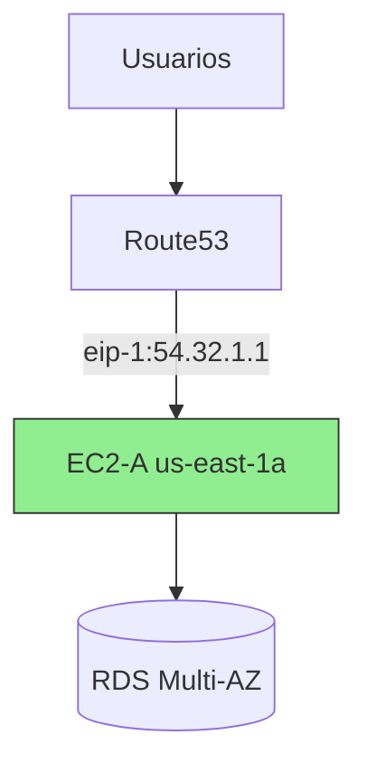

# **Laboratorio: Migración de IPs Elásticas para Recuperación de Desastres (DR)**

## **Objetivo del Laboratorio**
Aprender a redirigir tráfico entre instancias EC2 durante un fallo, manteniendo la misma IP pública mediante:
1. Reasignación de IPs Elásticas
2. Actualización de tablas de ruteo
3. Validación de conectividad

## **Arquitectura Inicial**


## **Paso 1: Configuración Inicial**
### **1.1 Crear recursos**
```bash
# Crear IP Elástica
EIP_ALLOC_ID=$(aws ec2 allocate-address --domain vpc --query 'AllocationId' --output text)

# Lanzar instancia EC2-A
INSTANCE_A_ID=$(aws ec2 run-instances \
    --image-id ami-0abcdef1234567890 \
    --instance-type t3.medium \
    --subnet-id subnet-123456 \
    --security-group-ids sg-123456 \
    --query 'Instances[0].InstanceId' \
    --output text)

# Asociar IP Elástica
aws ec2 associate-address \
    --instance-id $INSTANCE_A_ID \
    --allocation-id $EIP_ALLOC_ID
```

### **1.2 Verificar configuración**
```bash
aws ec2 describe-addresses --allocation-ids $EIP_ALLOC_ID
```
**Salida esperada**:
```json
{
    "PublicIp": "54.32.1.1",
    "InstanceId": "i-1234567890abcdef0"
}
```

## **Paso 2: Simular Falla (EC2-A Down)**


### **2.1 Detener instancia primaria**
```bash
aws ec2 stop-instances --instance-ids $INSTANCE_A_ID
```

## **Paso 3: Recuperación con EC2-B**
### **3.1 Lanzar instancia de respaldo**
```bash
# Lanzar EC2-B en AZ diferente
INSTANCE_B_ID=$(aws ec2 run-instances \
    --image-id ami-0abcdef1234567890 \
    --instance-type t3.medium \
    --subnet-id subnet-789012 \
    --security-group-ids sg-123456 \
    --query 'Instances[0].InstanceId' \
    --output text)
```

### **3.2 Reasignar IP Elástica**
```bash
# Desasociar de EC2-A
aws ec2 disassociate-address --association-id $(aws ec2 describe-addresses --allocation-ids $EIP_ALLOC_ID --query 'Addresses[0].AssociationId' --output text)

# Asociar a EC2-B
aws ec2 associate-address \
    --instance-id $INSTANCE_B_ID \
    --allocation-id $EIP_ALLOC_ID
```

## **Paso 4: Actualizar Rutas (Opcional para VPN/Direct Connect)**


### **4.1 Modificar tabla de ruteo**
```bash
# Obtener ID de tabla de ruteo
RTB_ID=$(aws ec2 describe-route-tables --query 'RouteTables[?Associations[?SubnetId==`subnet-789012`]].RouteTableId' --output text)

# Actualizar ruta
aws ec2 replace-route \
    --route-table-id $RTB_ID \
    --destination-cidr-block 0.0.0.0/0 \
    --instance-id $INSTANCE_B_ID
```

## **Paso 5: Validación**
### **5.1 Prueba de conectividad**
```bash
ping 54.32.1.1
curl http://54.32.1.1
```

### **5.2 Verificar nueva asociación**
```bash
aws ec2 describe-addresses --allocation-ids $EIP_ALLOC_ID
```
**Salida esperada**:
```json
{
    "PublicIp": "54.32.1.1",
    "InstanceId": "i-7890123456abcdef1"
}
```

## **Diagrama Final (Recuperación Exitosa)**


## **Costos y Consideraciones**
| **Concepto**               | **Detalle**                                                                 |
|----------------------------|-----------------------------------------------------------------------------|
| **Costo IP Elástica**      | $0.005/hr si no está asociada                                               |
| **Tiempo de Migración**    | <2 minutos (depende de health checks)                                       |
| **Mejor Práctica**         | Automatizar con AWS Lambda + CloudWatch Events                              |

## **Script de Automatización (Opcional)**
```python
import boto3

def lambda_handler(event, context):
    ec2 = boto3.client('ec2')
    
    # 1. Verificar estado EC2-A
    response = ec2.describe_instance_status(InstanceIds=['i-1234567890abcdef0'])
    if not response['InstanceStatuses'][0]['SystemStatus']['Status'] == 'ok':
        
        # 2. Reasignar IP
        ec2.disassociate_address(AssociationId='eipassoc-123456')
        ec2.associate_address(
            InstanceId='i-7890123456abcdef1',
            AllocationId='eipalloc-123456'
        )
        
        # 3. Actualizar Route Table
        ec2.replace_route(
            RouteTableId='rtb-123456',
            DestinationCidrBlock='0.0.0.0/0',
            InstanceId='i-7890123456abcdef1'
        )
```

## **Conclusión**
Este laboratorio demostró:
✅ **Migración sin cambios de IP** pública  
⚡ **Recuperación en minutos**  
🛡️ **Integración con otros servicios** (Route53, RDS)  

**¿Quieres profundizar?** Prueba:
1. Configurar **Health Checks** en Route53
2. Implementar **Auto Scaling Groups** con IPs Elásticas
3. Simular fallo con **AWS Fault Injection Simulator**
