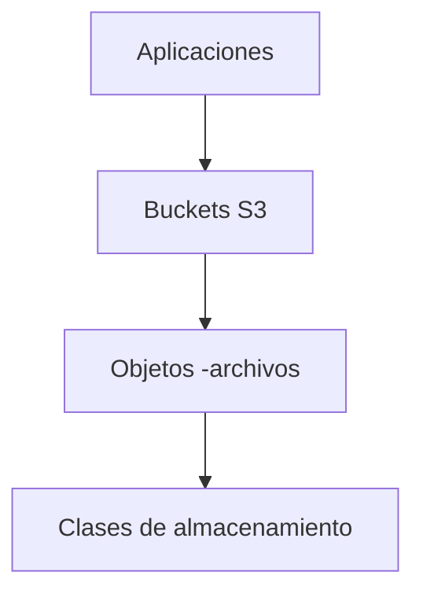
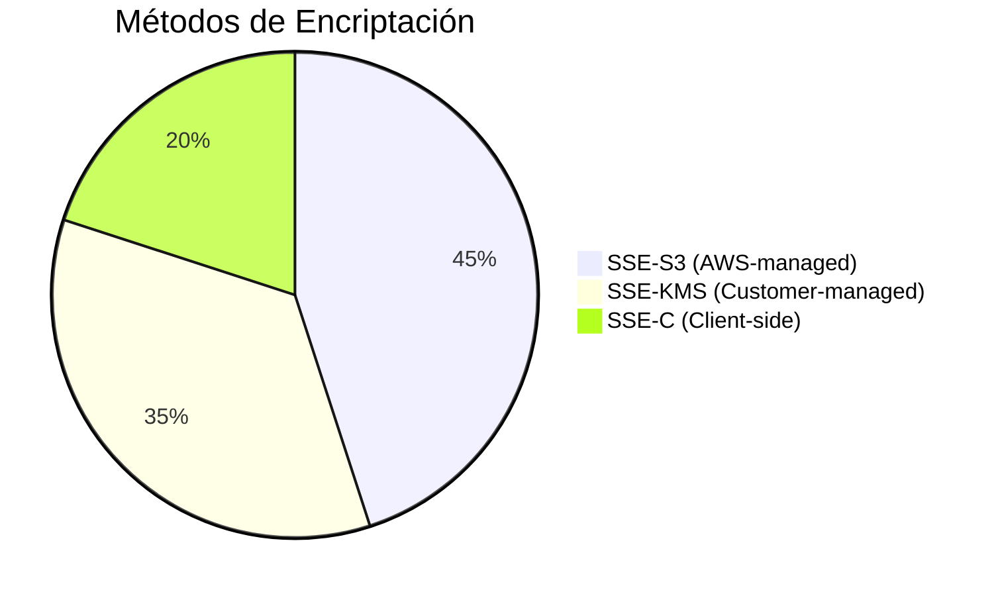

# **Amazon S3: El Servicio de Almacenamiento de Objetos de AWS**

## **Introducción a Amazon S3**
Amazon Simple Storage Service (S3) es el servicio de **almacenamiento de objetos** líder de AWS, lanzado en 2006. Ofrece:
- **Escalabilidad ilimitada**: Almacena desde bytes hasta exabytes.
- **Durabilidad del 99.999999999% (11 nueves)**: Datos replicados en múltiples AZs.
- **Alta disponibilidad**: SLA del 99.99%.



---

## **Componentes Clave de S3**
### **Estructura Básica**
| **Componente**  | **Descripción**                                                                 | **Ejemplo**                     |
|-----------------|-------------------------------------------------------------------------------|--------------------------------|
| **Bucket**      | Contenedor principal con nombre único global.                                 | `mi-bucket-datos`              |
| **Objeto**      | Archivo + metadatos (hasta 5TB).                                              | `informes/financiero.xlsx`     |
| **Key**         | Identificador único (ruta lógica).                                            | `marketing/campaña2023.pdf`    |
| **ACLs**        | Permisos granulares por objeto/bucket.                                        | Acceso público/privado.        |
| **Bucket Policy**| Reglas JSON para acceso avanzado (ej: solo desde ciertas IPs).                | [Ver política ejemplo]         |

---

## **Clases de Almacenamiento**
### **Comparativa de Opciones**
| **Clase**                | **Durabilidad** | **Disponibilidad** | **Costo**  | **Caso de Uso**                      |
|--------------------------|----------------|-------------------|-----------|--------------------------------------|
| **Standard**            | 11 nueves      | 99.99%            | $$$       | Datos frecuentemente accedidos.      |
| **Standard-IA**         | 11 nueves      | 99.9%             | $$        | Backup mensuales.                    |
| **One Zone-IA**         | 11 nueves*     | 99.5%             | $         | Datos recreables (testing).          |
| **Intelligent-Tiering** | 11 nueves      | 99.9%             | $$-$$$    | Datos con patrones de acceso variables. |
| **Glacier**             | 11 nueves      | 99.99% (horas)    | ¢         | Archivos legales (7+ años).          |

> *Datos almacenados en una sola AZ.

---

## **Funcionalidades Avanzadas**
### **Gestión del Ciclo de Vida**
Automatiza transiciones entre clases y eliminación:
```yaml
# Ejemplo de regla lifecycle (JSON)
{
  "Rules": [
    {
      "ID": "Mover a Glacier",
      "Status": "Enabled",
      "Prefix": "backups/",
      "Transitions": [
        {
          "Days": 90,
          "StorageClass": "GLACIER"
        }
      ],
      "Expiration": {
        "Days": 3650
      }
    }
  ]
}
```

### **Casos de Uso Comunes**
1. **Data Lakes**: Almacenamiento centralizado para analytics.
2. **Hosting Web**: Sitios estáticos (HTML, JS, imágenes).
3. **Backup**: Copias de seguridad automatizadas.
4. **Big Data**: Integración con EMR/Athena.
5. **IoT**: Almacenamiento de datos de dispositivos.

---

## **Seguridad y Acceso**
### **Mecanismos de Control**
- **IAM Policies**: Permisos basados en roles/usuarios.
- **Bucket Policies**: Reglas a nivel de bucket.
- **CORS**: Acceso desde dominios web específicos.
- **Encriptación**: SSE-S3, SSE-KMS, SSE-C.



---

## **Integraciones con AWS**
### **Servicios Clave**
| **Servicio**       | **Uso con S3**                                |
|--------------------|---------------------------------------------|
| **CloudFront**     | CDN para acelerar acceso global.             |
| **Lambda**         | Procesar archivos al subirse (ej: thumbnails).|
| **Glue**          | Catalogar datos para ETL.                    |
| **Snowball**      | Migrar petabytes offline.                    |

---

## **Conclusión**
Amazon S3 es ideal para:
✔ **Almacenamiento masivo** con alta durabilidad.  
✔ **Arquitecturas serverless** (ej: +Lambda).  
✔ **Cumplimiento normativo** (versionado, WORM).  

📌 **Mejor Práctica**: Usar **transfer acceleration** para subidas internacionales grandes.  

🔗 **Documentación**: [Amazon S3](https://docs.aws.amazon.com/AmazonS3/latest/userguide/Welcome.html)  

¡Comienza con el tier gratuito (5GB x 12 meses) y escala sin límites! 🚀
