# **Seguridad, Versionado y Replicación en Amazon S3: Conceptos Avanzados**

## **Protección de Datos en Amazon S3**

### **Mecanismos de Seguridad Clave**
Amazon S3 ofrece múltiples capas de seguridad para garantizar la protección de datos:


#### **Tabla Comparativa de Controles de Acceso**
| **Método**          | **Nivel**       | **Ventaja**                                  | **Ejemplo de Uso**                     |
|---------------------|----------------|--------------------------------------------|----------------------------------------|
| **Bucket Policies** | Nivel bucket   | Permisos granulares basados en condiciones | Restringir acceso por IP o AWS account |
| **IAM Policies**    | Nivel usuario  | Integración con roles IAM                  | Acceso programático seguro             |
| **ACLs**           | Objeto/bucket | Control básico heredado                    | Acceso público a assets web            |

---

## **Versionado de Objetos**
### **Cómo Funciona el Versionado**
1. **Habilitación**: Activación por bucket (irreversible, solo se puede suspender).
2. **Efectos**:
   - Cada modificación crea nueva versión (ID único).
   - Eliminaciones añaden "delete marker" en lugar de borrar.
3. **Recuperación**:
   - Eliminar el "delete marker" restaura la versión anterior.

**Ejemplo Práctico**:
```bash
# Listar todas las versiones
aws s3api list-object-versions --bucket mi-bucket --prefix informe.pdf

# Restaurar versión específica
aws s3api copy-object --bucket mi-bucket --key informe.pdf \
--copy-source "mi-bucket/informe.pdf?versionId=ABC123"
```

---

## **Replicación de Datos**
### **Tipos de Replicación**
| **Tipo**       | **Descripción**                                  | **Caso de Uso**                      |
|----------------|------------------------------------------------|--------------------------------------|
| **CRR**        | Cross-Region Replication (Entre regiones)      | Disaster Recovery / Baja latencia global |
| **SRR**        | Same-Region Replication (Misma región)         | Cumplimiento regulatorio             |

**Flujo de Replicación**:
1. Configurar reglas en el bucket origen.
2. Especificar bucket destino y región.
3. S3 replica asíncronamente (usualmente en minutos).

```mermaid
sequenceDiagram
    Usuario->>Bucket Origen: Sube/Modifica objeto
    Bucket Origen->>Bucket Destino: Replicación automática
    Bucket Destino-->>CloudWatch: Métricas de estado
```



---

## **Modelo de Costos**
### **Factores de Facturación**
1. **Almacenamiento**: 
   - Varía por clase (Standard $0.023/GB vs Glacier $0.004/GB).
2. **Transferencia**:
   - $0.09/GB saliente (primeros 10TB/mes).
3. **Operaciones**:
   - PUT/COPY: $0.005/1000 solicitudes.
   - GET: $0.0004/1000 solicitudes.
4. **Features adicionales**:
   - Replicación CRR: $0.02/GB replicado.
   - Transfer Acceleration: $0.04-$0.08/GB.

**Ejemplo Costo Mensual**:
- 100GB Standard + 1TB saliente + 10M solicitudes ≈ **$120 USD**.

---

## **Conclusión**
Amazon S3 proporciona:
✔ **Protección empresarial** con versionado y replicación.  
✔ **Flexibilidad de costos** con múltiples clases de almacenamiento.  
✔ **Cumplimiento normativo** mediante controles granulares.  

📌 **Mejor Práctica**: Usar **SSE-KMS** para datos sensibles + **MFA Delete** como protección adicional.  

🔗 **Documentación**: [Amazon S3 Security](https://docs.aws.amazon.com/AmazonS3/latest/userguide/security-best-practices.html)  

¡Configura estas funcionalidades para maximizar el valor de tu almacenamiento en la nube! 🔒🔄
