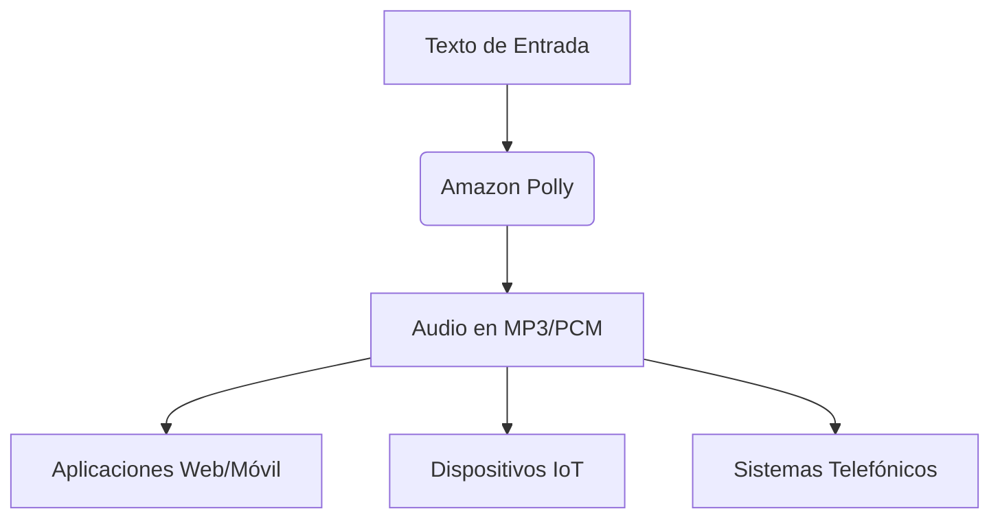
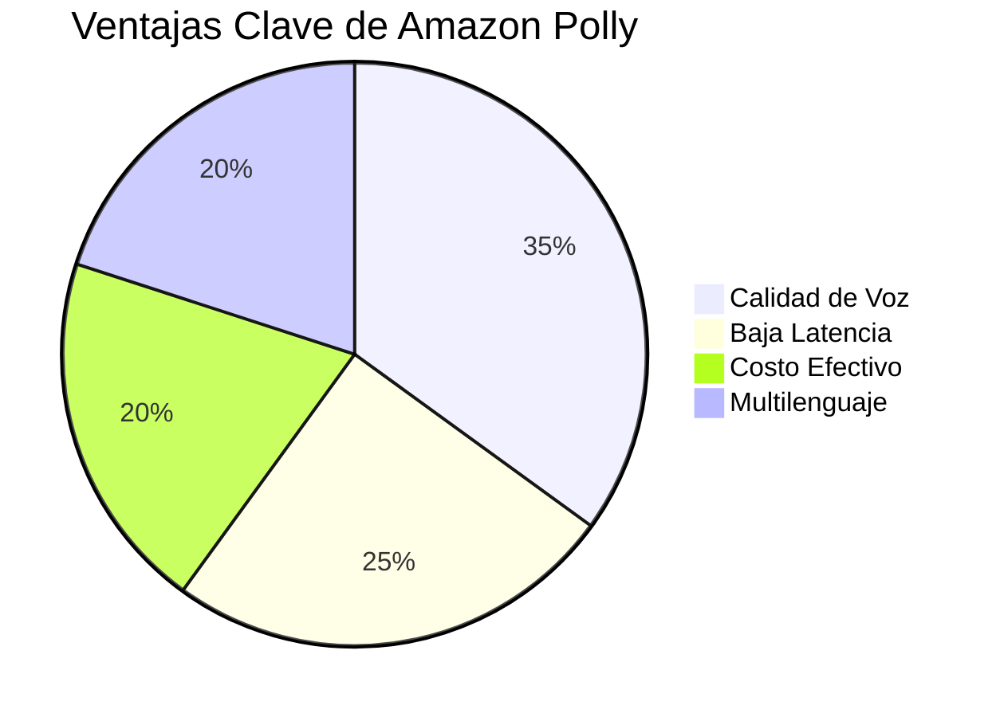

# **Amazon Polly: Conversión de Texto a Voz con IA Avanzada**  

## **¿Qué es Amazon Polly?**  
Amazon Polly es un **servicio de AWS** que convierte texto en **voz realista** utilizando tecnologías avanzadas de **aprendizaje profundo (deep learning)**. Ofrece voces **neuronales (NTTS)** y estándar **(TTS)** para generar un habla natural con alta precisión en pronunciación, incluyendo abreviaturas, acrónimos y formatos de fecha/hora.  

---  

## **Beneficios de Amazon Polly**  

### **1. Calidad Superior**  
- Voces neuronales (NTTS) para mejoras en claridad y naturalidad.  
- Tecnología TTS estándar para síntesis de voz fluida.  
- Pronunciación precisa incluso en términos complejos.  

### **2. Baja Latencia**  
- Respuestas rápidas, ideal para aplicaciones en tiempo real.  
- Adecuado para:  
  - Asistentes virtuales  
  - Sistemas de respuesta interactiva (IVR)  
  - Contenido multimedia  

### **3. Costo Efectivo**  
- Modelo de **pago por uso** (sin costos iniciales).  
- Escalable según demanda.  
- Reduce la necesidad de recursos locales (CPU, almacenamiento).  

### **4. Soporte Multilenguaje**  
- Amplia variedad de idiomas y voces (masculinas/femeninas).  
- Actualizaciones automáticas sin requerir cambios en dispositivos.  

### **5. Formatos de Salida Flexibles**  
- **MP3** (para web/móvil).  
- **PCM** (para IoT y soluciones de telefonía).  

---  

## **¿Cómo Funciona Amazon Polly?**  

1. **Entrada de Texto**  
   - Proporciona el texto que deseas convertir.  

2. **Selección de Voz**  
   - Elige entre voces en diferentes idiomas (masculinas/femeninas).  

3. **Formato de Salida**  
   - Recibe el audio en MP3, PCM u otros formatos.  

---  

## **Idiomas y Voces Disponibles**  

| **Idioma**       | **Voces Disponibles** |  
|------------------|----------------------|  
| Inglés (EE.UU.)  | Masculino / Femenino |  
| Portugués (BR)   | Masculino / Femenino |  
| Francés          | Masculino / Femenino |  
| Japonés          | Masculino / Femenino |  
| Alemán           | Masculino / Femenino |  

*(Consulta la lista completa en la documentación oficial de AWS).*  

---  

## **Casos de Uso**  

### **1. Creación de Contenido**  
- Convertir artículos en audio (ej. podcasts automáticos).  
- Integración con **AWS Lambda + S3** para almacenamiento.  

**Flujo de Trabajo:**  
1. Lambda extrae el texto.  
2. Polly lo convierte en voz.  
3. El audio se guarda en **Amazon S3**.  

### **2. eLearning**  
- **Sincronización de voz con animaciones faciales**.  
- **Resaltado de texto** al estilo karaoke.  

**Tecnologías Involucradas:**  
- **Amazon DynamoDB** (índice de archivos).  
- **Amazon CloudFront** (distribución global).  

### **3. Telefonía (IVR)**  
- Respuestas naturales en centros de contacto.  
- Ejemplo: Consulta de saldo bancario por voz.  

**Proceso:**  
1. El cliente llama al centro de contacto.  
2. Polly genera la respuesta en audio.  
3. El sistema reproduce la información.  

---  

## **Conclusión**  
Amazon Polly es una solución **escalable, económica y de alta calidad** para integrar **voz natural** en aplicaciones. Sus casos de uso abarcan desde **eLearning** hasta **telefonía inteligente**, facilitando experiencias más interactivas y accesibles.  

