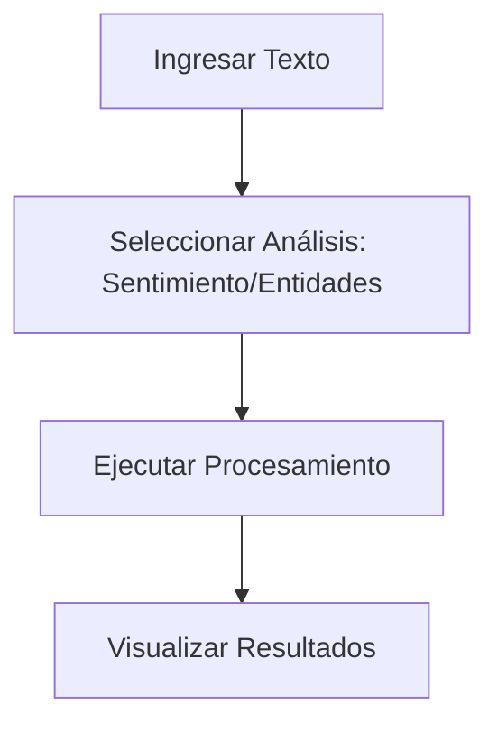

# **Análisis de Texto con Amazon Comprehend: Extracción de Insights con NLP**

## **Introducción a Amazon Comprehend**
Amazon Comprehend es un servicio de **procesamiento de lenguaje natural (NLP)** que utiliza **aprendizaje profundo** para analizar texto y extraer información valiosa como:
- **Entidades** (nombres, lugares, organizaciones).  
- **Frases clave**.  
- **Sentimientos** (positivo, negativo, neutral).  
- **Idioma dominante**.  
- **Información personal identificable (PII)**.  

---

## **Laboratorio Práctico: Análisis de Sentimientos en Comentarios**
### **Paso 1: Acceso al Servicio**
1. **Entorno Gratuito/Sandbox**:
   - Inicia sesión en la [Consola AWS](https://aws.amazon.com/console/).
   - Busca **"Amazon Comprehend"** en la barra de servicios.
   - Selecciona **"Try Amazon Comprehend"** (modo demo gratuito).

### **Paso 2: Configuración del Análisis**


#### **Opciones de Análisis**:
| **Función**          | **Descripción**                                                                 |
|-----------------------|-------------------------------------------------------------------------------|
| **Detección de Entidades** | Identifica personas, lugares, fechas, etc. Ej: "Apple" → ORGANIZACIÓN.       |
| **Análisis de Sentimiento** | Clasifica texto como positivo/negativo/neutral. Ej: "Me encanta" → Positivo. |
| **Detección de PII**       | Encuentra datos sensibles (ej: números de tarjetas de crédito).              |

### **Paso 3: Ejemplo Práctico**
**Texto de Ejemplo**:
```plaintext
"El nuevo iPhone 15 tiene una cámara increíble, pero la batería dura poco."
```

**Resultados Esperados**:
- **Sentimiento**: `Mixto` (positivo por "cámara increíble", negativo por "batería dura poco").
- **Entidades**: 
  - `iPhone 15` → PRODUCTO.
- **Frases Clave**: "nuevo iPhone 15", "cámara increíble", "batería dura poco".

---

## **Beneficios Clave**
### **Tabla Comparativa**
| **Beneficio**               | **Detalle**                                                                 |
|-----------------------------|-----------------------------------------------------------------------------|
| **Bajo Costo**              | Pago por uso ($0.0001 por unidad de texto). Sin costos iniciales.           |
| **Escalable**               | Analiza millones de documentos en minutos.                                  |
| **Integración con AWS**     | Compatible con S3, Lambda, y KMS para flujos automatizados.                |
| **Seguridad**               | Encriptación de datos con AWS KMS.                                          |
| **Precisión**               | Modelos entrenados con deep learning para múltiples dominios.               |

---

## **Casos de Uso**
### **Lista de Aplicaciones**
1. **Centros de Contacto**:
   - Analizar sentimentos en chats/emails para mejorar servicio al cliente.
2. **Sector Legal**:
   - Extraer cláusulas clave de contratos y redactar PII automáticamente.
3. **Finanzas**:
   - Procesar reclamos de seguros o informes de crédito.
4. **Retail**:
   - Clasificar reseñas de productos para identificar tendencias.

---

## **Lenguajes Soportados**
Amazon Comprehend soporta:
- **Inglés**, **Español**, **Francés**, **Alemán**, **Portugués**, **Italiano**, entre otros.  
> 📌 **Nota**: Algunas funciones (como PII) tienen soporte limitado por idioma.

---

## **Ejemplo de API con Python**
```python
import boto3
client = boto3.client('comprehend')

response = client.detect_sentiment(
    Text="El servicio fue excelente, pero el envío llegó tarde",
    LanguageCode='es'
)
print(response['Sentiment'])  # Resultado: 'MIXED'
```

---

## **Conclusión**
Amazon Comprehend permite:
✔ **Automatizar análisis de texto** sin necesidad de expertise en NLP.  
✔ **Mejorar decisiones empresariales** con insights accionables.  
✔ **Integrarse fácilmente** con otros servicios AWS (S3, Redshift, etc.).  

📌 **Tip**: Usa el **nivel gratuito** para procesar hasta 50,000 unidades de texto/mes.  

🔗 **Documentación**: [AWS Comprehend](https://docs.aws.amazon.com/comprehend/latest/dg/what-is.html)  
