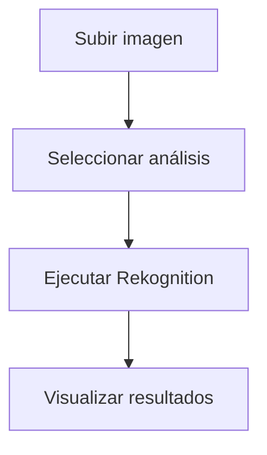

# **Análisis de Imágenes y Videos con Amazon Rekognition: Guía Práctica**

## **Introducción a Amazon Rekognition**
Amazon Rekognition es un servicio de **visión por computadora** que permite analizar imágenes y videos para:
- Identificar **objetos, personas, texto y escenas**.
- Detectar **contenido inapropiado**.
- Realizar **análisis facial** (comparación, búsqueda y verificación).
- Extraer **texto** de imágenes (OCR).

Basado en tecnología de **deep learning** de Amazon, no requiere expertise en machine learning.

---

## **Laboratorio Práctico: Análisis de Imágenes con Free Tier**
### **Paso 1: Acceso al Servicio**
1. **Consola AWS**:
   - Ingresa a [AWS Console](https://aws.amazon.com/console/).
   - Busca **"Rekognition"** en la barra de servicios.
   - Selecciona **"Demo de Amazon Rekognition"** (gratis sin configuración).

### **Paso 2: Procesar una Imagen**


#### **Opciones de Análisis**:
| **Función**               | **Descripción**                                                                 |
|---------------------------|-------------------------------------------------------------------------------|
| **Detección de Etiquetas** | Identifica objetos (ej: "perro", "coche").                                    |
| **Detección de Texto**    | Extrae texto escrito (OCR).                                                  |
| **Análisis Facial**       | Detecta emociones, edad, género y compara rostros.                           |
| **Moderación**            | Encuentra contenido explícito o violento.                                    |

### **Paso 3: Ejemplo con Imagen de Prueba**
**Imagen**: Foto de una persona en un parque con un cartel que dice "Welcome".

**Resultados**:
- **Etiquetas**: `Persona (99%)`, `Parque (85%)`, `Césped (78%)`.
- **Texto Detectado**: "Welcome" (confianza del 95%).
- **Análisis Facial**: 
  - Emoción: `Feliz (92%)`.
  - Rango de edad: `25-32 años`.

---

## **Beneficios Clave**
### **Tabla Comparativa**
| **Beneficio**               | **Detalle**                                                                 |
|-----------------------------|-----------------------------------------------------------------------------|
| **Bajo Costo**              | $0.001 por imagen (primeros 1,000 análisis/mes gratis en Free Tier).       |
| **Escalable**               | Procesa millones de imágenes/videos diarios.                               |
| **Integración con AWS**     | Compatible con S3, Lambda, y Kinesis para flujos automatizados.            |
| **Precisión**               | Modelos entrenados con billones de imágenes.                                |
| **Fácil Implementación**    | API simple sin necesidad de conocimientos en computer vision.               |

---

## **Casos de Uso**
### **Lista de Aplicaciones**
1. **Seguridad Pública**:
   - Búsqueda de personas desaparecidas mediante comparación facial.
2. **Retail**:
   - Catalogación automática de productos por imágenes.
3. **Redes Sociales**:
   - Moderación de contenido inapropiado.
4. **Accesibilidad**:
   - Aplicaciones para personas con discapacidad visual que describan imágenes.

---

## **Flujo de Trabajo con API**
### **Ejemplo con AWS CLI**
```bash
# Detectar etiquetas en una imagen almacenada en S3
aws rekognition detect-labels \
    --image '{"S3Object":{"Bucket":"mi-bucket","Name":"foto.jpg"}}' \
    --region us-east-1
```

**Respuesta JSON**:
```json
{
  "Labels": [
    {
      "Name": "Dog",
      "Confidence": 98.5,
      "Instances": []
    }
  ]
}
```

---

## **Conclusión**
Amazon Rekognition permite:
✔ **Automatizar el análisis visual** sin infraestructura compleja.  
✔ **Mejorar experiencias de usuario** (ej: búsqueda por imagen).  
✔ **Cumplir normativas** con moderación automática de contenido.  

📌 **Tip**: Usa el **Free Tier** para hasta **5,000 análisis de imágenes/mes**.  

🔗 **Documentación**: [AWS Rekognition](https://docs.aws.amazon.com/rekognition/latest/dg/what-is.html)  
