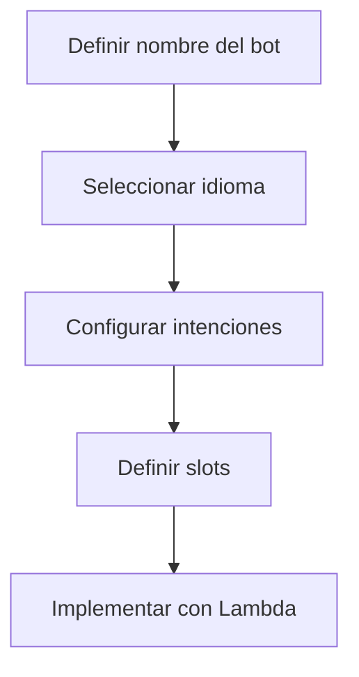

# **Amazon Lex**

## **Introducción a Amazon Lex**
Amazon Lex es un servicio de AWS para crear **interfaces conversacionales** mediante voz y texto. Combina:
- **Reconocimiento automático de voz (ASR)**
- **Comprensión del lenguaje natural (NLU)**

Permite desarrollar chatbots, asistentes virtuales y aplicaciones controladas por voz sin necesidad de experiencia en machine learning.

---

## **Laboratorio Práctico: Creación de un Bot Básico (Free Tier)**
### **Paso 1: Acceso al Servicio**
1. **Consola AWS**:
   - Inicia sesión en [AWS Console](https://aws.amazon.com/console/).
   - Busca **"Lex"** y selecciona **"Amazon Lex V2"**.
   - Haz clic en **"Crear bot"**.

### **Paso 2: Configuración del Bot**


#### **Opciones Clave**:
| **Componente**  | **Descripción**                                                                 |
|-----------------|-------------------------------------------------------------------------------|
| **Intención**   | Acción que el usuario quiere realizar (ej: "PedirPizza").                     |
| **Slots**       | Parámetros requeridos (ej: tamaño, tipo de masa).                            |
| **Muestras**    | Frases de ejemplo para entrenar al bot (ej: "Quiero ordenar una pizza").     |

### **Paso 3: Ejemplo - Bot para Pedidos de Pizza**
1. **Crear Intención**:
   - Nombre: `PedirPizza`.
   - Muestras: 
     - "Quiero una pizza"
     - "Deseo ordenar una pizza mediana"

2. **Definir Slots**:
   - `Tamaño`: [pequeña, mediana, grande]
   - `Masa`: [delgada, gruesa]
   - `Cantidad`: Número (usar slot type `AMAZON.NUMBER`).

3. **Configurar Lambda** (opcional):
   - Crear función Lambda para procesar pedidos y devolver confirmación.

---

## **Beneficios Clave**
### **Tabla Comparativa**
| **Beneficio**               | **Detalle**                                                                 |
|-----------------------------|-----------------------------------------------------------------------------|
| **Bajo Costo**              | Primeros 10,000 textos y 5,000 audios/mes gratis (Free Tier).              |
| **Integración con AWS**     | Conecta con Lambda, DynamoDB y S3 para backend.                            |
| **Multiplataforma**         | Funciona en web, móvil, Facebook Messenger y dispositivos IoT.             |
| **Escalabilidad**           | Maneja miles de conversaciones simultáneas automáticamente.                |

---

## **Casos de Uso**
### **Lista de Aplicaciones**
1. **Atención al Cliente**:
   - Chatbots para soporte 24/7.
2. **IVR Inteligente**:
   - Sistemas de respuesta de voz interactiva.
3. **Productividad Empresarial**:
   - Asistentes para RRHH (consultas de beneficios).
4. **Ventas**:
   - Automatización de pedidos en CRM.

---

## **Arquitectura Típica**
```
┌─────────────────────────────────────────────────────────────────┐
│                          Aplicación Cliente                     │
│  (Web, Móvil, Facebook, etc.)                                   │
└───────────────────────────────┬─────────────────────────────────┘
                                │
┌───────────────────────────────▼─────────────────────────────────┐
│                          Amazon Lex                             │
│  (Procesa voz/texto → Identifica intenciones → Llama a Lambda)  │
└───────────────────────────────┬─────────────────────────────────┘
                                │
┌───────────────────────────────▼─────────────────────────────────┐
│                          AWS Lambda                             │
│  (Ejecuta lógica: guarda en DynamoDB, envía confirmación, etc.) │
└─────────────────────────────────────────────────────────────────┘
```

---

## **Precios (Ejemplo)**
| **Tipo de Uso**           | **Costo**                     | **Free Tier**                     |
|---------------------------|-------------------------------|-----------------------------------|
| **Texto**                 | $0.75/1,000 solicitudes       | 10,000/mes (primer año).          |
| **Voz**                   | $4/1,000 solicitudes          | 5,000/mes (primer año).           |
| **Streaming de Voz**      | $0.01/intervalo de 15 segundos| No incluido.                      |

---

## **Conclusión**
Amazon Lex permite:
✔ **Crear chatbots avanzados** sin infraestructura compleja.  
✔ **Mejorar la experiencia del usuario** con interacciones naturales.  
✔ **Reducir costos operativos** en atención al cliente.  

📌 **Tip**: Usa el **Free Tier** para prototipar tu primer bot sin costo.  

🔗 **Documentación**: [AWS Lex](https://docs.aws.amazon.com/lex/latest/dg/what-is.html)  
